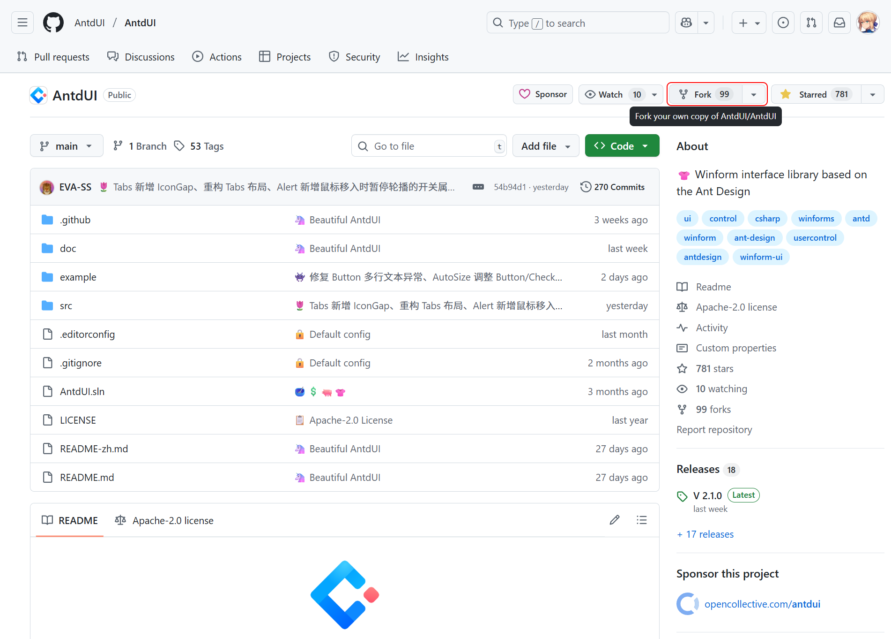
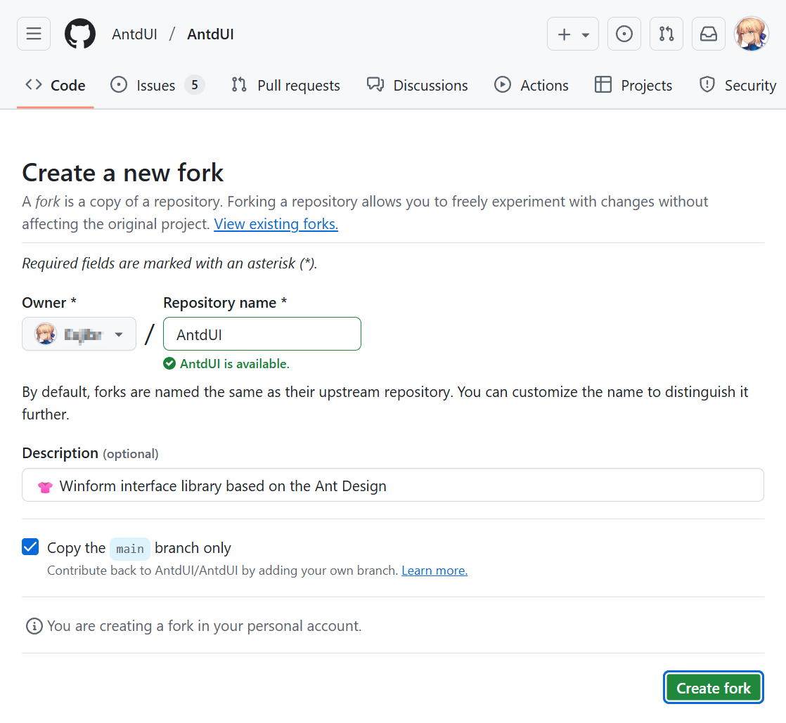
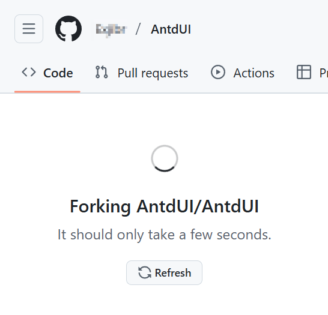
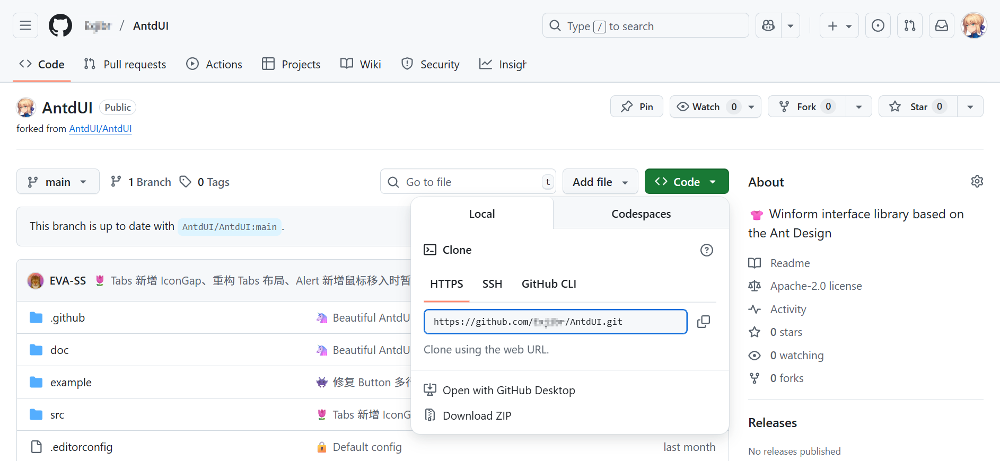
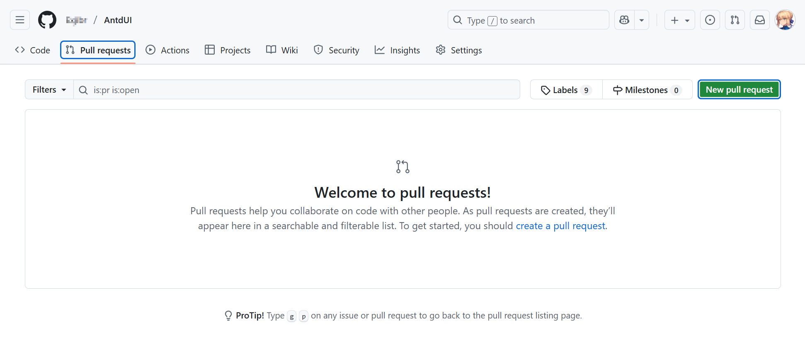
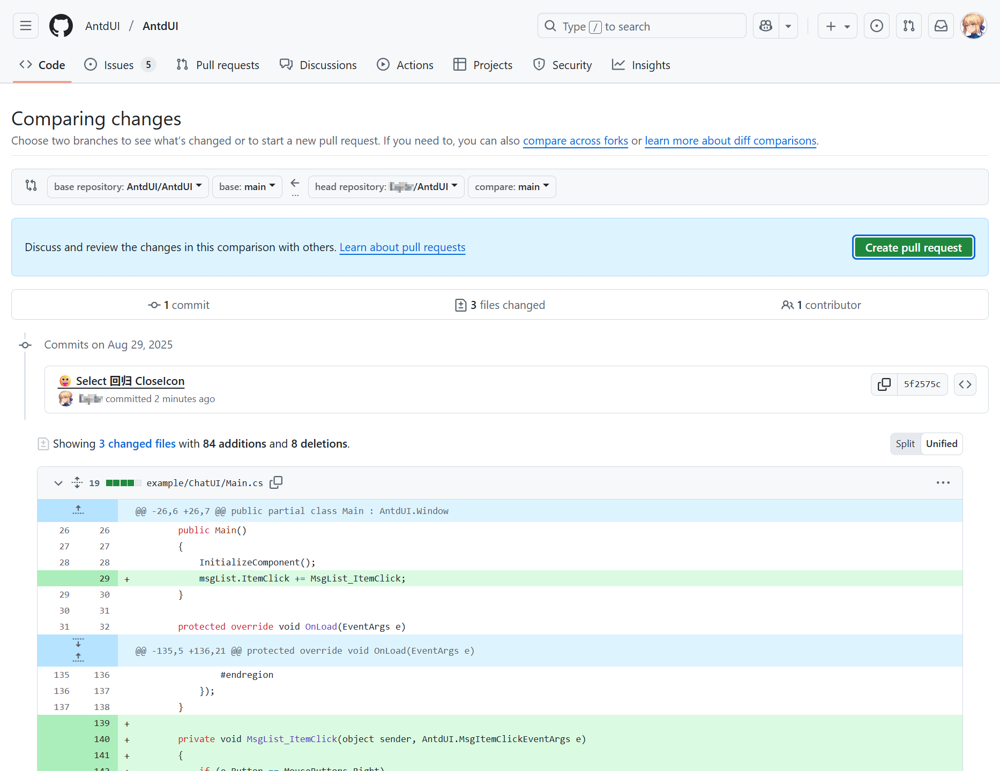
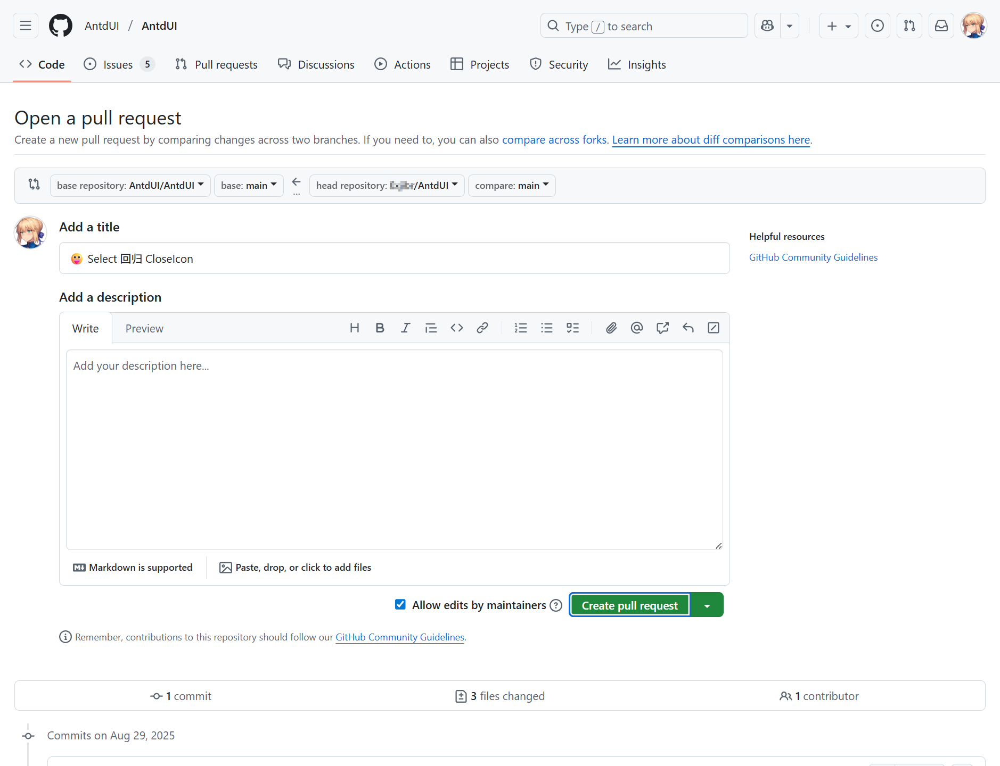
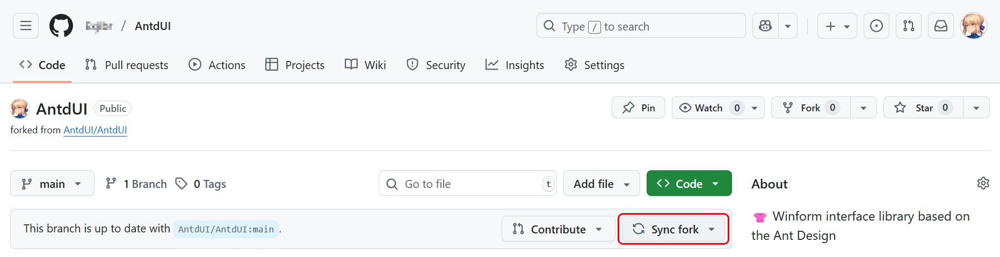

# 🦄 Contributing to AntdUI

This guide explains the standards and workflows to help you collaborate smoothly, maintain code consistency, and navigate the project effectively.

## 1. Directory Structure
Familiarize yourself with the directory layout to ensure your contributions are placed in the correct location:

```
AntdUI/
├─ src/                      # Core source code for all libraries
│  └─ AntdUI/                # Main UI library code
│     ├─ Controls/           # Custom UI controls
│     │  ├─ Core/            # Abstract drawing classes and implementation classes (base for all controls)
│     │  └─ Chat/            # Chat-related controls (separated due to independent logic or large code volume)
│     ├─ Design/             # Designer support (e.g., Visual Studio designer integration)
│     ├─ Enum/               # Enumerations used across the library (e.g., theme types, control states)
│     ├─ Forms/              # Custom windows/forms (e.g., main application windows)
│     ├─ LayeredWindow/      # Popup/layered windows (e.g., dropdowns, date pickers, Modals, drawers)
│     ├─ Lib/                # Utility files (Win32 API wrappers, SVG handlers, helper classes)
│     ├─ Localization/       # Multi-language support (resource files for different locales)
│     └─ Style/              # Theme definitions (e.g., light/dark themes, color palettes)
├─ samples/                  # Demo projects to showcase control usage
│  └─ Demo/                  # Main demo project (includes test forms for all controls)
└─ doc/                      # Documentation (contribution guides, API references, etc.)
```

- **New Controls**: Add custom controls to `src/AntdUI/Controls/` (use subfolders like `Chat/` for independent/large controls).
- **Utility Code**: Place helper functions, Win32 wrappers, or SVG tools in `src/AntdUI/Lib/`.
- **Demo Code**: Update `samples/Demo/` to include test cases for new features (helps verify functionality and assist other contributors).


## 2. Code Standards
To maintain consistency and avoid common issues (e.g., memory leaks, UI glitches), follow these core rules:


### 2.1 Drawing Logic Requirements
AntdUI relies on a custom drawing system for high-quality UI rendering. Adhere to these rules for all visual controls:

- **Must Implement `AntdUI.IControl`**:
  All drawable controls **must inherit from `AntdUI.IControl`** (the base interface for custom rendering). Override the `OnDraw` method to implement control-specific drawing:
  ```csharp
  public class MyCustomControl : IControl
  {
      // Override OnDraw to handle rendering
      protected override void OnDraw(DrawEventArgs e)
      {
          base.OnDraw(e);
          // Use e.Canvas for drawing (see note below)
          e.Canvas.DrawText("Hello AntdUI", _textFont, _textColor, ClientRectangle);
      }
  }
  ```

- **Use `Canvas` for Rendering**:
  The `Canvas` class (accessed via `Graphics.High()` if `IControl` is not inherited) provides built-in support for **high-quality text** (e.g., anti-aliasing) and **Emoji rendering**—features not natively supported by GDI’s `Graphics` class.
  - If you cannot inherit `IControl` (e.g., for system control wrappers), use `Canvas` like this:
    ```csharp
    var canvas = e.Graphics.High(); // Get Canvas instance
    string emoji = "👍";
    Size size = canvas.MeasureText(emoji, Font);
    canvas.DrawText(emoji, Font, Style.Db.Text, new Rectangle(0, 0, size.Width, size.Height));
    ```

- **Resource Disposal**:
  Always release GDI resources (e.g., `Bitmap`, `Brush`, `Pen`) immediately after use to avoid memory leaks. Use `using` statements for automatic disposal:
  ```csharp
  // Recommended: Auto-dispose Brush with 'using'
  using (var fillBrush = new SolidBrush(_backgroundColor))
  {
      e.Canvas.Fill(fillBrush, ClientRectangle);
  }

  // Avoid: Unmanaged resource leaks (no Dispose)
  var badBrush = new SolidBrush(_backgroundColor); 
  e.Canvas.Fill(badBrush, ClientRectangle); // ❌ Leaks memory
  ```


### 2.2 List Control Standards
For controls with scrollable content (e.g., list boxes, data grids), follow these rules to ensure consistency:

- **Use `AntdUI.ScrollBar`**:
  Do not use system scrollbars—always integrate `AntdUI.ScrollBar` (the library’s custom scrollbar component) for uniform styling and behavior.

- **Expose Public Properties**:
  Make scrollbar-related properties accessible to external code (e.g., for customization by end-users).


### 2.3 `IControl.RenderRegion` Usage
The `GraphicsPath RenderRegion` property in `AntdUI.IControl` is critical for **correct mask rendering** (e.g., for Spin controls on rounded-corner components).

- **Set `RenderRegion` for Rounded Controls**:
  If your control has rounded corners (or non-rectangular shapes), define `RenderRegion` to ensure Spin controls (or other overlay elements) respect the control’s shape:
  ```csharp
  protected override GraphicsPath RenderRegion
  {
      get
      {
          return ClientRectangle.RoundPath(8 * Config.Dpi);
      }
  }
  ```
  - Without `RenderRegion`, overlays like Spin may display as rectangular (breaking the UI’s visual consistency).


## 3. Contribution Workflow

> To demonstrate how to contribute code using [**Pull Request**](https://github.com/AntdUI/AntdUI/compare/main...main) (referred to as "PR" below)

### 3.1 First, Fork the official [AntdUI](https://github.com/AntdUI/AntdUI) repository to your own account

> Click the **Fork** button in the upper right corner



### 3.2 Confirm the fork target

> By default, it will fork to your personal account. Click **Create fork** to continue



> Wait for the forking process to complete. The page will refresh automatically once finished.
> 

### 3.3 Clone the repository from your personal account

> Click **Code**, then copy the `.git` URL from the pop-up window. ⚠ Note: Ensure it's the URL from your **own repository**



Open [Visual Studio](https://visualstudio.microsoft.com), clone the URL you just copied, and after successful cloning, **commit the code you want to contribute**.

### 3.4 Initiate [PR](https://github.com/AntdUI/AntdUI/compare/main...main)

> Click the **Pull requests** tab, or [click **Pull Request** to jump to the PR submission page](https://github.com/AntdUI/AntdUI/compare/main...main), then click **New pull request** to start the PR



### 3.5 Final step

> After verifying and adjusting your submission, click **Create pull request**



> Fill in the PR title and description. Clearly state what changes you made and why you made them. Click **Create pull request** again to confirm submission



> I will review your PR as soon as I receive it. 🧙 Have a nice day!

### Note: Remember to sync with the official repository before your next contribution



---

Thank you for helping improve AntdUI—your contributions make this project better for everyone! 🚀