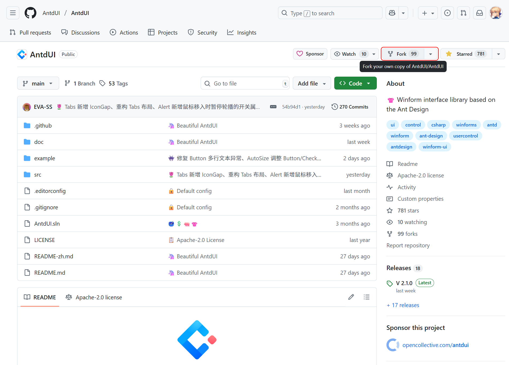
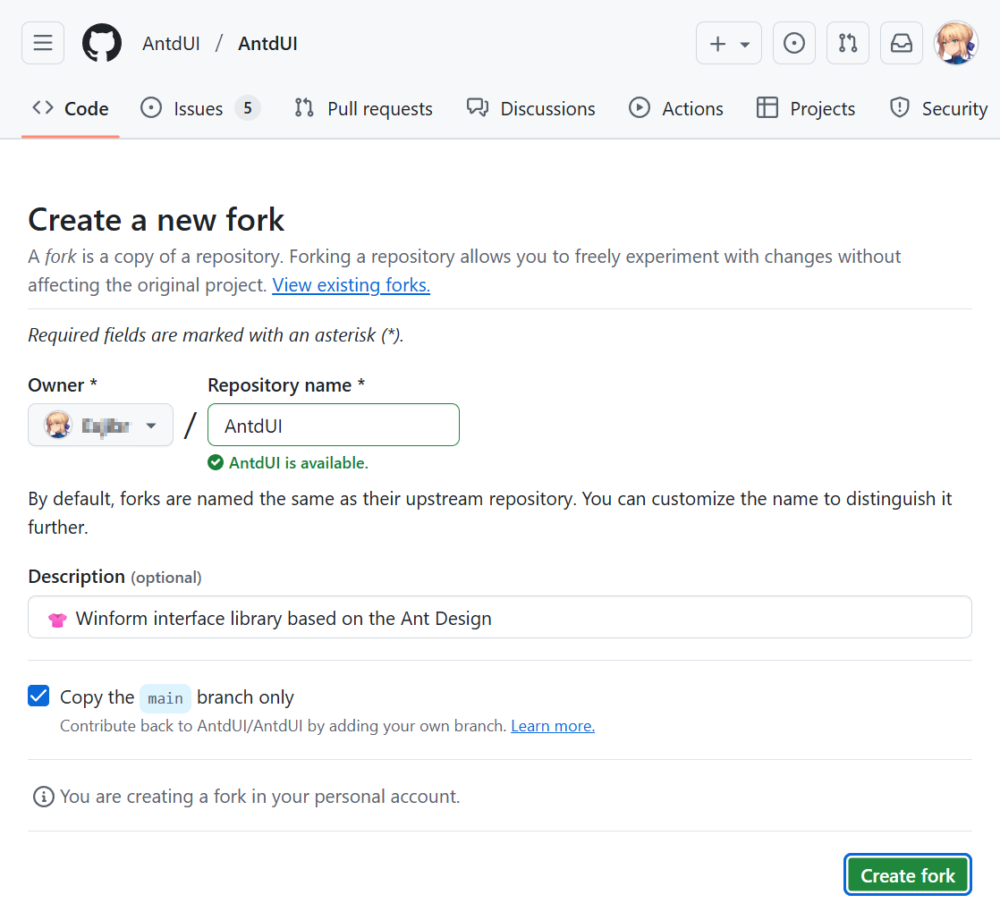
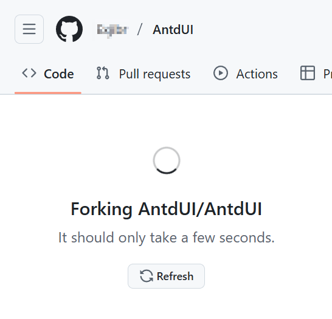
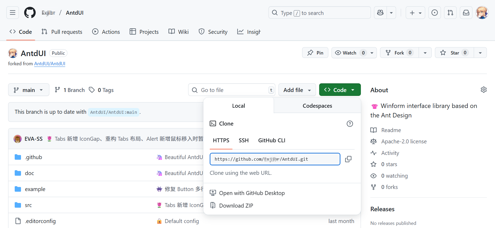
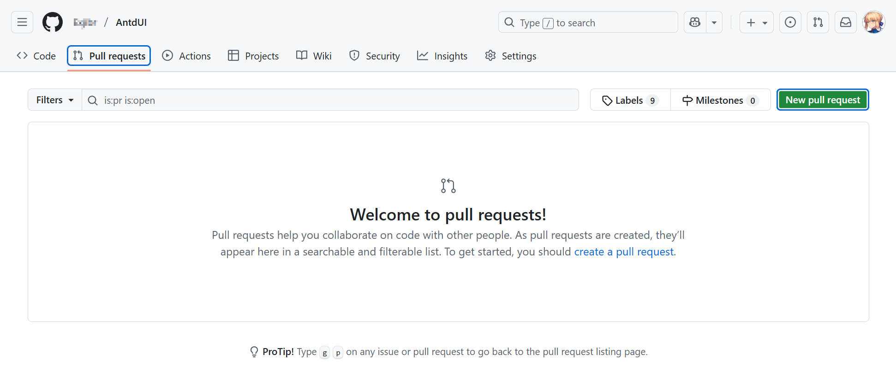
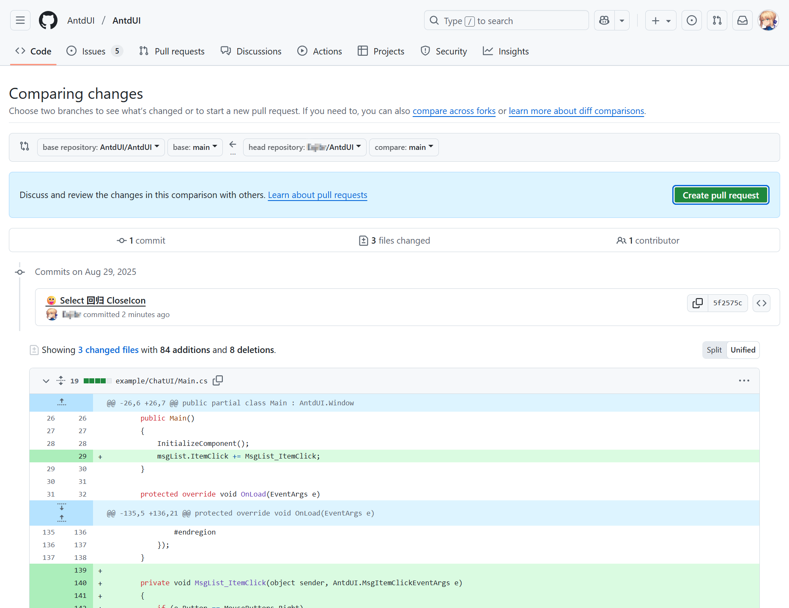
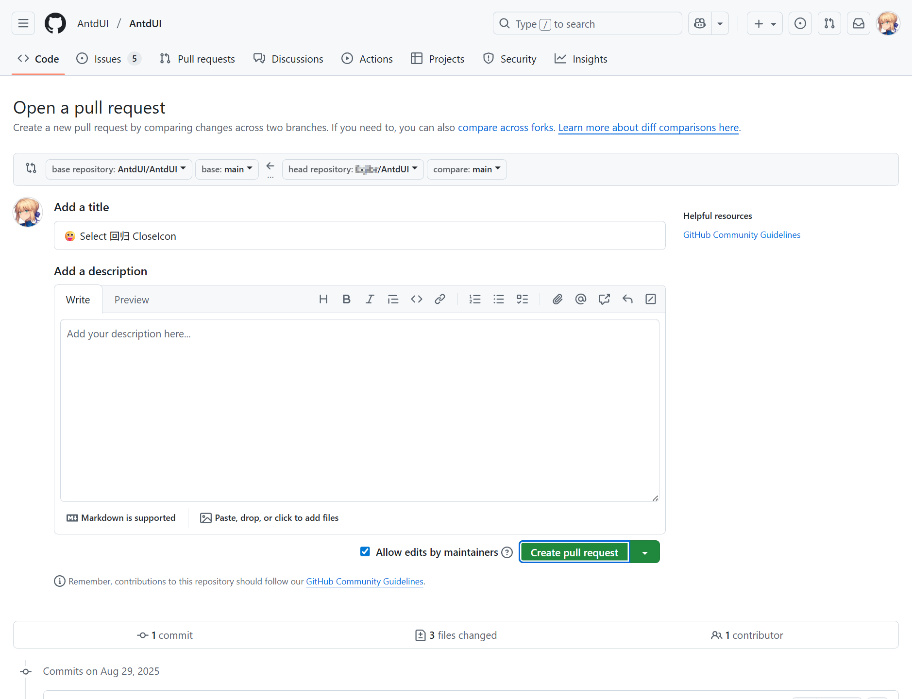
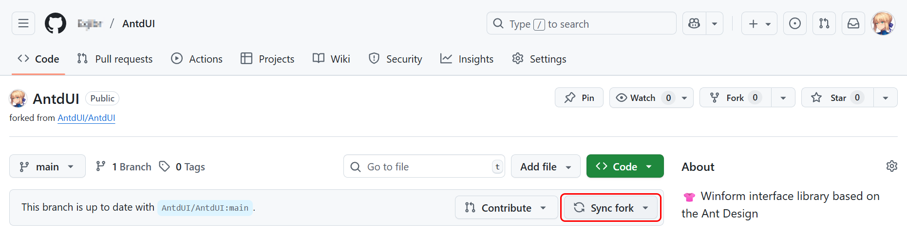

# 🦄 Contributing to AntdUI

This guide explains the standards and workflows to help you collaborate smoothly, maintain code consistency, and navigate the project effectively.

## 1. Directory Structure
Familiarize yourself with the directory layout to ensure your contributions are placed in the correct location:

```
AntdUI/
├─ src/                      # All core library source code
│  ├─ AntdUI/                # Main UI library code
│  │  ├─ Controls/           # Custom UI controls
│  │  │  ├─ Chat/            # Chat-related controls (separated due to independent logic or large code volume)
│  │  │  └─ Core/            # Core drawing classes and implementation classes
│  │  ├─ Design/             # Designer support (e.g., Visual Studio designer integration)
│  │  ├─ Enum/               # Enumerations used across the library (e.g., theme types, control states)
│  │  ├─ Events/             # Event definitions
│  │  ├─ Forms/              # Custom windows/forms
│  │  │  └─ LayeredWindow/   # Popup/layered windows (e.g., dropdowns, date pickers, modals, drawers)
│  │  ├─ Lib/                # Utility files (Win32 API wrappers, SVG handlers, helper classes)
│  │  ├─ Localization/       # Multi-language support (resource files for different locales)
│  │  └─ Style/              # Theme definitions (e.g., light/dark themes, color palettes)
│  └─ AntdUI.EmojiFluentFlat/ # Emoji Fluent Flat resource library
├─ example/                  # Demo projects to showcase control usage
│  └─ Demo/                  # Main demo project (includes test forms for all controls)
└─ doc/                      # Documentation (contribution guides, API references, etc.)
```

- **New Controls**: Add custom controls to `src/AntdUI/Controls/` (use subfolders like `Chat/` for independent or large controls).
- **Utility Code**: Place helper functions, Win32 wrappers, or SVG tools in `src/AntdUI/Lib/`.
- **Demo Code**: Update `example/Demo/` to include test cases for new features (helps verify functionality and assist other contributors).

## 2. Code Standards
To maintain consistency and avoid common issues (e.g., memory leaks, UI glitches), follow these core rules:

### 2.1 Drawing Logic Requirements
AntdUI relies on a custom drawing system for high-quality UI rendering. All visual controls must follow:

- **Must Implement `AntdUI.IControl`**:
  All drawable controls **must inherit from `AntdUI.IControl`** (the base interface for custom rendering). Override the `OnDraw` method to implement control-specific drawing:
  ```csharp
  public class MyCustomControl : IControl
  {
	  // Override OnDraw to handle rendering logic
	  protected override void OnDraw(DrawEventArgs e)
	  {
		  base.OnDraw(e);
		  // Use e.Canvas for drawing (see explanation below)
		  e.Canvas.DrawText("Hello AntdUI", _textFont, _textColor, ClientRectangle);
	  }
  }
  ```

- **Use `Canvas` for Rendering**:
  Direct use of `Graphics` is not recommended. Instead, use `Canvas` for rendering to achieve better performance and consistency.
  - Implement complete rendering through `OnDraw` + `OnDrawBg` methods
  - If you cannot inherit `IControl` (e.g., for system control wrappers), obtain `Canvas` instance via `Graphics.High()`
  - For `Bitmap` drawing, use `HighLay` method
  ```csharp
  // Get Canvas in Winform OnPaint
  var canvas = e.Graphics.High(); // Get Canvas instance
  
  // Bitmap drawing
  using (var bitmap = new Bitmap(width, height))
  using (var graphics = Graphics.FromImage(bitmap))
  using (var canvas = graphics.HighLay()) // Use HighLay for bitmap drawing
  {
	  // Drawing logic
  }
  ```

- **Text Rendering Specification**:
  - Do not use `StringFormat` for layout; instead, use `AntdUI.FormatFlags`
  - For text containing Emoji, use `MeasureText` + `DrawText` (Emoji-adapted internally) instead of `MeasureString` + `String`
  ```csharp
  // Recommended: Use FormatFlags and DrawText
  var flags = FormatFlags.Left | FormatFlags.VerticalCenter;
  var size = canvas.MeasureText("Hello 👍", Font, flags);
  canvas.DrawText("Hello 👍", Font, Style.Db.Text, ClientRectangle, flags);
  ```

- **Resource Disposal**:
  Always release GDI resources (e.g., `Bitmap`, `Brush`, `Pen`) immediately after use to avoid memory leaks. Use `using` statements for automatic disposal:
  ```csharp
  // Recommended: Auto-dispose Brush with 'using'
  using (var fillBrush = new SolidBrush(_backgroundColor))
  {
	  e.Canvas.Fill(fillBrush, ClientRectangle);
  }

  // Avoid: Unmanaged resource leaks
  var badBrush = new SolidBrush(_backgroundColor); 
  e.Canvas.Fill(badBrush, ClientRectangle); // ❌ Causes memory leak
  ```

### 2.2 List Control Standards
For controls with scrollable content (e.g., list boxes, data grids), follow these rules:

- **Use `AntdUI.ScrollBar`**:
  Do not use system scrollbars. You must integrate the library's built-in `AntdUI.ScrollBar` component to ensure consistent styling and behavior.

- **Public Properties**:
  Expose scrollbar-related properties to external code (for user customization).

### 2.3 `IControl.RenderRegion` Usage
The `GraphicsPath RenderRegion` property in `AntdUI.IControl` is crucial for **correct mask rendering** (e.g., Spin controls on rounded-corner components).

- **Set `RenderRegion` for Rounded Controls**:
  If your control has rounded corners (or non-rectangular shapes), define `RenderRegion` to ensure Spin controls (or other overlay elements) adapt to the control's shape:
  ```csharp
  protected override GraphicsPath RenderRegion
  {
	  get
	  {
		  return ClientRectangle.RoundPath(8 * Config.Dpi);
	  }
  }
  ```  
  - Without `RenderRegion`, overlay elements like Spin may display as rectangular, breaking UI consistency.

## 3. Contribution Workflow

> To demonstrate how to contribute code using [**Pull Request**](https://github.com/AntdUI/AntdUI/compare/main...main) (referred to as "PR" below)

### 3.1 First, Fork the official [AntdUI](https://github.com/AntdUI/AntdUI) repository to your own account

> Click the **Fork** button in the upper right corner



### 3.2 Confirm the fork target

> By default, it will fork to your personal account. Click **Create fork** to continue



> Wait for the forking process to complete. The page will refresh automatically once finished.
> 

### 3.3 Clone the repository from your personal account

> Click **Code**, then copy the `.git` URL from the pop-up window. ⚠ Note: Ensure it's the URL from your **own repository**



Open [Visual Studio](https://visualstudio.microsoft.com), clone the URL you just copied, and after successful cloning, **commit the code you want to contribute**.

### 3.4 Initiate [PR](https://github.com/AntdUI/AntdUI/compare/main...main)

> Click the **Pull requests** tab, or [click **Pull Request** to jump to the PR submission page](https://github.com/AntdUI/AntdUI/compare/main...main), then click **New pull request** to start the PR



### 3.5 Final step

> After verifying and adjusting your submission, click **Create pull request**



> Fill in the PR title and description. Clearly state what changes you made and why you made them. Click **Create pull request** again to confirm submission



> I will review your PR as soon as I receive it. 🧙 Have a nice day!

### Note: Remember to sync with the official repository before your next contribution



---

Thank you for helping improve AntdUI—your contributions make this project better for everyone! 🚀