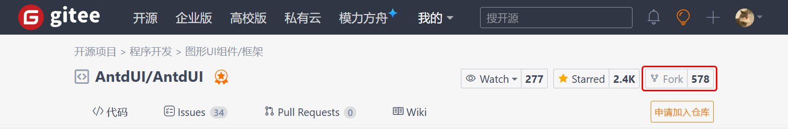
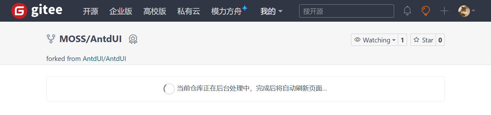
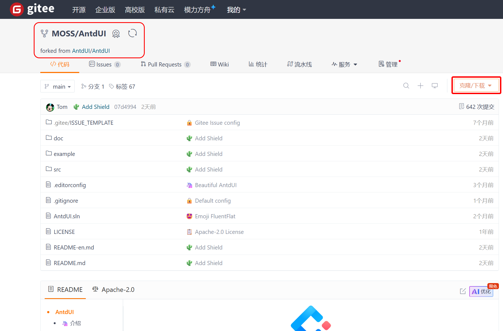
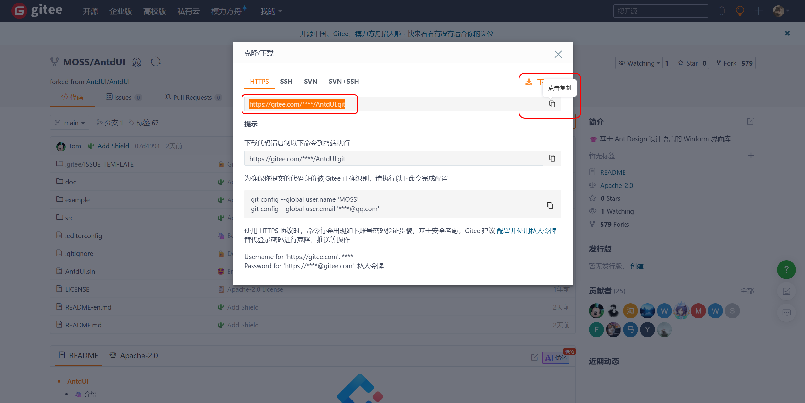
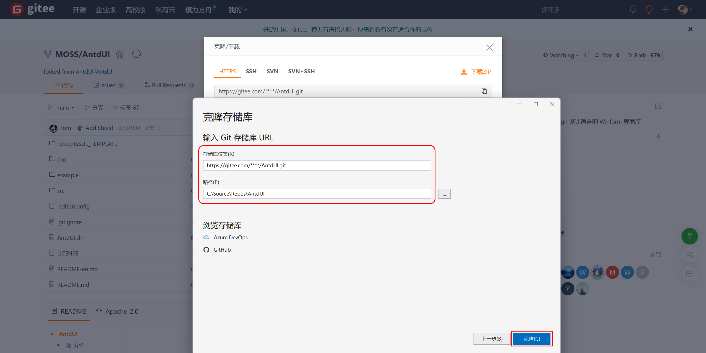
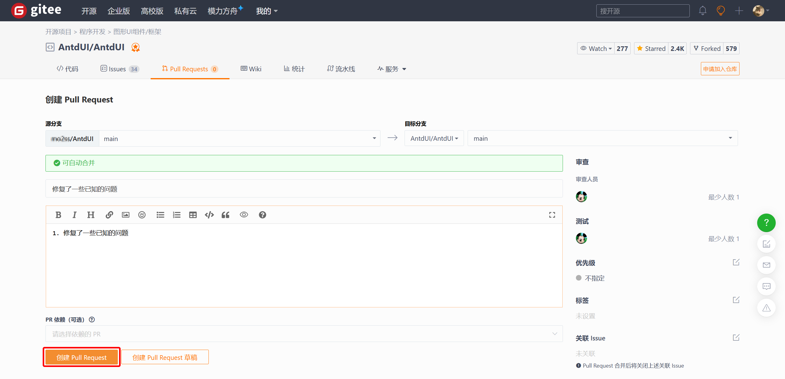

# 🦄 参与 AntdUI 贡献

本文档将介绍参与 AntdUI 贡献的标准和工作流程，帮助你顺利协作、保持代码一致性，并高效熟悉项目。


## 1. 目录结构
请先了解项目的目录布局，确保你的贡献内容放在正确位置：

```
AntdUI/
├─ src/                      # 所有核心库源代码
│  └─ AntdUI/                # 主UI库代码
│     ├─ Controls/           # 自定义UI控件
│     │  ├─ Core/            # 抽象绘制类和实现类（所有控件的基础）
│     │  └─ Chat/            # 聊天相关控件（因逻辑独立或代码量较大而单独存放）
│     ├─ Design/             # 设计器支持（如Visual Studio设计器集成）
│     ├─ Enum/               # 库中通用的枚举（如主题类型、控件状态）
│     ├─ Forms/              # 自定义窗口/表单（如主应用窗口）
│     ├─ LayeredWindow/      # 弹窗/分层窗口（如下拉框、日期选择器、模态框、抽屉等）
│     ├─ Lib/                # 工具文件（Win32 API封装、SVG处理、辅助类）
│     ├─ Localization/       # 多语言支持（不同地区的资源文件）
│     └─ Style/              # 主题定义（如明暗主题、调色板）
├─ samples/                  # 用于展示控件用法的示例项目
│  └─ Demo/                  # 主示例项目（包含所有控件的测试窗体）
└─ doc/                      # 文档（贡献指南、API参考等）
```

- **新增控件**：请添加到 `src/AntdUI/Controls/`（独立或大型控件可像 `Chat/` 一样使用子文件夹）。
- **工具代码**：辅助函数、Win32封装或SVG工具请放在 `src/AntdUI/Lib/`。
- **示例代码**：请更新 `samples/Demo/` 以包含新功能的测试用例（有助于验证功能并帮助其他贡献者）。


## 2. 代码规范
为保持一致性并避免常见问题（如内存泄漏、UI异常），请遵循以下核心规则：


### 2.1 绘制逻辑要求
AntdUI 依赖自定义绘制系统实现高质量UI渲染。所有可视化控件需遵循：

- **必须实现 `AntdUI.IControl`**：
  所有可绘制控件**必须继承 `AntdUI.IControl`**（自定义渲染的基础接口）。通过重写 `OnDraw` 方法实现控件特定绘制：
  ```csharp
  public class MyCustomControl : IControl
  {
      // 重写OnDraw处理渲染逻辑
      protected override void OnDraw(DrawEventArgs e)
      {
          base.OnDraw(e);
          // 使用e.Canvas进行绘制（见下方说明）
          e.Canvas.DrawText("Hello AntdUI", _textFont, _textColor, ClientRectangle);
      }
  }
  ```

- **使用 `Canvas` 进行渲染**：
  `Canvas` 类（若无法继承 `IControl`，可通过 `Graphics.High()` 获取）提供**高质量文本**（如抗锯齿）和**Emoji渲染**支持——这些是GDI原生 `Graphics` 类不具备的特性。
  - 若无法继承 `IControl`（如系统控件封装），可这样使用 `Canvas`：
    ```csharp
    var canvas = e.Graphics.High(); // 获取Canvas实例
    string emoji = "👍";
    Size size = canvas.MeasureText(emoji, Font);
    canvas.DrawText(emoji, Font, Style.Db.Text, new Rectangle(0, 0, size.Width, size.Height));
    ```

- **资源释放**：
  GDI资源（如 `Bitmap`、`Brush`、`Pen`）使用后必须立即释放，避免内存泄漏。推荐使用 `using` 语句自动释放：
  ```csharp
  // 推荐：使用using自动释放Brush
  using (var fillBrush = new SolidBrush(_backgroundColor))
  {
      e.Canvas.Fill(fillBrush, ClientRectangle);
  }

  // 避免：未释放非托管资源
  var badBrush = new SolidBrush(_backgroundColor); 
  e.Canvas.Fill(badBrush, ClientRectangle); // ❌ 导致内存泄漏
  ```


### 2.2 列表类控件规范
对于带滚动内容的控件（如列表框、数据网格），请遵循：

- **使用 `AntdUI.ScrollBar`**：
  禁止使用系统滚动条，必须集成库内置的 `AntdUI.ScrollBar` 组件，以保证样式和行为统一。

- **公共属性**：
  需将滚动条相关属性开放给外部代码（方便用户自定义）。 


### 2.3 `IControl.RenderRegion` 用法
`AntdUI.IControl` 中的 `GraphicsPath RenderRegion` 属性对**遮罩正确渲染**至关重要（如圆角控件上的Spin控件）。

- **圆角控件需设置 `RenderRegion`**：
  若控件为圆角（或非矩形），需定义 `RenderRegion` 以确保Spin控件（或其他覆盖元素）适配控件形状：
  ```csharp
  protected override GraphicsPath RenderRegion
  {
      get
      {
          return ClientRectangle.RoundPath(8 * Config.Dpi);
      }
  }
  ```  
  - 若不设置 `RenderRegion`，Spin等覆盖元素可能显示为矩形，破坏UI一致性。


## 3. 贡献流程

> 以下演示如何通过 [**合并请求（Pull Request，简称PR）**](https://gitee.com/AntdUI/AntdUI/compare/main...main) 贡献代码


### 3.1 首先在 [AntdUI](https://gitee.com/AntdUI/AntdUI) 官方仓库，Fork 到自己账号

> 点击右上角 **Fork** 按钮



### 3.2 选择 Fork 目标空间

> 默认个人，也就是自己，点击 **确认** 继续


> 等待 Fork 完成，完成后会自动跳转
> 

### 3.3 在自己空间地址克隆项目

> 点击 **克隆/下载**，⚠ 注意是自己的**空间地址**



点击第一个 `.git` 地址复制



### 3.4 提交贡献代码到自己仓库

> 打开 [Visual Studio](https://visualstudio.microsoft.com) 克隆刚刚复制的地址，选择目录，点击 **克隆** 继续



克隆成功后，提交需要贡献的代码

### 3.5 发起 [PR](https://gitee.com/AntdUI/AntdUI/compare/main...main)

> 点击 **Pull requests** 选项卡，或者[点击**Pull Request**跳转提交PR页面](https://gitee.com/AntdUI/AntdUI/compare/main...main)


点击 **新建 Pull Request**


### 大功告成

提交内容调整核实后，点击 **创建 Pull Request**



> 收到后，我会尽快审核，🧙 生活愉快

---

感谢您为AntdUI的改进提供帮助——您的贡献让这个项目变得更好！🚀