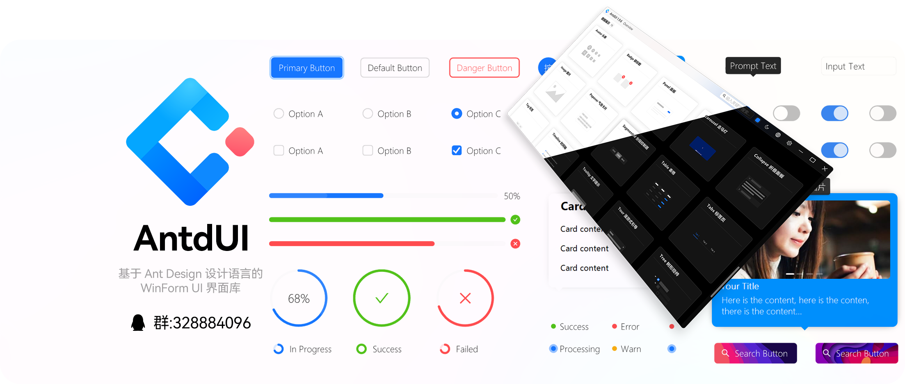

<h1>AntdUI</h1>

中文・[English](README.md)・[文档](doc/wiki/zh/Home.md)・[演示](https://gitee.com/mubaiyanghua/antdui-demo)

### 🦄 介绍

基于 Ant Design 设计语言的 WinForm UI 界面库，致力于将现代美观的前端设计风格带入到桌面应用程序中。采用纯GDI绘图，不需任何图片资源，全面支持AOT，最低兼容 `.NET Framework 4.0`

### ✨ 特性

- 🌈 现代化的设计风格
- 🎨 精细绘制与流畅动画
- 🚀 在 Winform 上呈现最佳阴影效果
- 📦 无边框窗口，保留原生窗口特性
- 💎 3D翻转特效
- 👚 主题自定义
- 🦜 SVG 矢量图
- 👓 DPI 自适应
- 🌍 全球化支持

### 🖥 环境

- .NET 6.0及更高版本。
- .NET Framework4.8及以上。
- .NET Framework4.0及以上。

### 🌴 控件

⬇️| 通用 `2` | 动画 | 禁用 |
:---:|:--|:--:|:--:|
➡️| [**Button** 按钮](doc/wiki/zh/Control/Button.md) | ✅ | ✅ |
➡️| [**FloatButton** 悬浮按钮](doc/wiki/zh/Control/FloatButton.md) | ✅ | ❎ |
||||
⬇️| 布局 `4` | 动画 | 禁用 |
➡️| [**Divider** 分割线](doc/wiki/zh/Control/Divider.md) | ❎ | ❎ |
➡️| [**StackPanel** 堆栈布局](doc/wiki/zh/Control/StackPanel.md) | ❎ | ❎ |
➡️| [**FlowPanel** 流动布局](doc/wiki/zh/Control/FlowPanel.md) | ❎ | ❎ |
➡️| [**GridPanel** 格栅布局](doc/wiki/zh/Control/GridPanel.md) | ❎ | ❎ |
||||
⬇️| 导航 `6` | 动画 | 禁用 |
➡️| [**Breadcrumb** 面包屑](doc/wiki/zh/Control/Breadcrumb.md) | ✅ | ❎ |
➡️| [**Dropdown** 下拉菜单](doc/wiki/zh/Control/Dropdown.md) | ✅ | ✅ |
➡️| [**Menu** 导航菜单](doc/wiki/zh/Control/Menu.md) | ✅ | ❎ |
➡️| [**PageHeader** 页头](doc/wiki/zh/Control/PageHeader.md) | ✅ | ❎ |
➡️| [**Pagination** 分页](doc/wiki/zh/Control/Pagination.md) | ✅ | ✅ |
➡️| [**Steps** 步骤条](doc/wiki/zh/Control/Steps.md) | ❎ | ❎ |
||||
⬇️| 数据录入 `13` | 动画 | 禁用 |
➡️| [**Checkbox** 多选框](doc/wiki/zh/Control/Checkbox.md) | ✅ | ✅ |
➡️| [**ColorPicker** 颜色选择器](doc/wiki/zh/Control/ColorPicker.md) | ✅ | ✅ |
➡️| [**DatePicker** 日期选择框](doc/wiki/zh/Control/DatePicker.md) | ✅ | ✅ |
➡️| [**DatePickerRange** 日期范围选择框](doc/wiki/zh/Control/DatePicker#DatePickerRange.md) | ✅ | ✅ |
➡️| [**Input** 输入框](doc/wiki/zh/Control/Input.md) | ✅ | ✅ |
➡️| [**InputNumber** 数字输入框](doc/wiki/zh/Control/Input#InputNumber.md) | ✅ | ✅ |
➡️| [**Radio** 单选框](doc/wiki/zh/Control/Radio.md) | ✅ | ✅ |
➡️| [**Rate** 评分](doc/wiki/zh/Control/Rate.md) | ✅ | ❎ |
➡️| [**Select** 选择器](doc/wiki/zh/Control/Select.md) | ✅ | ✅ |
➡️| [**Slider** 滑动输入条](doc/wiki/zh/Control/Slider.md) | ✅ | ❎ |
➡️| [**Switch** 开关](doc/wiki/zh/Control/Switch.md) | ✅ | ✅ |
➡️| [**TimePicker** 时间选择框](doc/wiki/zh/Control/TimePicker.md) | ✅ | ✅ |
➡️| [**UploadDragger** 拖拽上传](doc/wiki/zh/Control/UploadDragger.md) | ✅ | ❎ |
||||
⬇️| 数据展示 `17` | 动画 | 禁用 |
➡️| [**Avatar** 头像](doc/wiki/zh/Control/Avatar.md) | ❎ | ❎ |
➡️| [**Badge** 徽标数](doc/wiki/zh/Control/Badge.md) | ✅ | ❎ |
➡️| [**Calendar** 日历](doc/wiki/zh/Control/Calendar.md) | ✅ | ❎ |
➡️| [**Panel** 面板](doc/wiki/zh/Control/Panel.md) | ✅ | ❎ |
➡️| [**Carousel** 走马灯](doc/wiki/zh/Control/Carousel.md) | ✅ | ❎ |
➡️| [**Collapse** 折叠面板](doc/wiki/zh/Control/Collapse.md) | ✅ | ❎ |
➡️| [**Preview** 图片预览](doc/wiki/zh/Control/Preview.md) | ✅ | ✅ |
➡️| [**Popover** 气泡卡片](doc/wiki/zh/Control/Popover.md) | ✅ | ❎ |
➡️| [**Segmented** 分段控制器](doc/wiki/zh/Control/Segmented.md) | ✅ | ✅ |
➡️| [**Table** 表格](doc/wiki/zh/Control/Table.md) | ✅ | ❎ |
➡️| [**Tabs** 标签页](doc/wiki/zh/Control/Tabs.md) | ✅ | ❎ |
➡️| [**Tag** 标签](doc/wiki/zh/Control/Tag.md) | ✅ | ❎ |
➡️| [**Timeline** 时间轴](doc/wiki/zh/Control/Timeline.md) | ❎ | ❎ |
➡️| [**Tooltip** 文字提示](doc/wiki/zh/Control/Tooltip.md) | ✅ | ❎ |
➡️| [**Tree** 树形控件](doc/wiki/zh/Control/Tree.md) | ✅ | ✅ |
➡️| [**Label** 文本](doc/wiki/zh/Control/Label.md) | ✅ | ❎ |
➡️| [**LabelTime** 时间文本](doc/wiki/zh/Control/LabelTime.md) | ✅ | ❎ |
||||
⬇️| 反馈 `7` | 动画 | 禁用 |
➡️| [**Alert** 警告提示](doc/wiki/zh/Control/Alert.md) | ✅ | ❎ |
➡️| [**Drawer** 抽屉](doc/wiki/zh/Control/Drawer.md) | ✅ | ❎ |
➡️| [**Message** 全局提示](doc/wiki/zh/Control/Message.md) | ✅ | ❎ |
➡️| [**Modal** 对话框](doc/wiki/zh/Control/Modal.md) | ✅ | ❎ |
➡️| [**Notification** 通知提醒框](doc/wiki/zh/Control/Notification.md) | ✅ | ❎ |
➡️| [**Progress** 进度条](doc/wiki/zh/Control/Progress.md) | ✅ | ❎ |
➡️| [**Spin** 加载中](doc/wiki/zh/Control/Spin.md) | ✅ | ❎ |
||||
⬇️| 聊天 `2` | 动画 | 禁用 |
➡️| **MsgList** 好友消息列表 | ✅ | ❎ |
➡️| **ChatList** 气泡聊天列表 | ✅ | ❎ |
||||
⬇️| 其他 `5` | 动画 | 禁用 |
➡️| [**WindowBar** 窗口栏](doc/wiki/zh/Control/WindowBar.md) | ✅ | ❎ |
➡️| [**Battery** 电量](doc/wiki/zh/Control/Battery.md) | ✅ | ❎ |
➡️| [**Signal** 信号强度](doc/wiki/zh/Control/Signal.md) | ✅ | ❎ |
➡️| [**ContextMenuStrip** 右键菜单](doc/wiki/zh/Control/ContextMenuStrip.md) | ✅ | ❎ |
➡️| **Image3D** 图片3D | ✅ | ❎ |

### 🐿️ 捐赠 🥣💲🐖👚

### 🎨 截图

#### ChatUI

> 纯GDI，不是TextBox等拖控件

#### 控件

| **Button** 按钮 | **Badge** 徽标数 |
| :--: | :--: |
|  |  |
| **Carousel** 走马灯 | **Input** 输入框 |
|  |  |
| **Progress** 进度条 | **Avatar** 头像 |
|  |  |
| **Checkbox** 多选框 | **Radio** 单选框 |
|  |  |
| **Tooltip** 提示 | **Panel** 面板 |
|  |  |
| **Tabs** 标签页 | **Alert** 警告提示 |
|  |  |
| **Segmented** 分段控制器 | **Menu** 导航菜单 |
|  |  |
| **Divider** 分割线 | **Slider** 滑动条 |
|  |  |
| **Message** 全局提示 | **Notification** 通知提醒框 |
|  |  |
| **Switch** 开关 | **Table** 表格 |
|  |  |

## 📢 特别声明

AntdUI 项目已加入 [dotNET China](https://gitee.com/dotnetchina)  组织。 

🦦 招募小伙伴一起维护项目