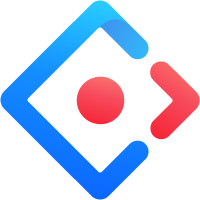
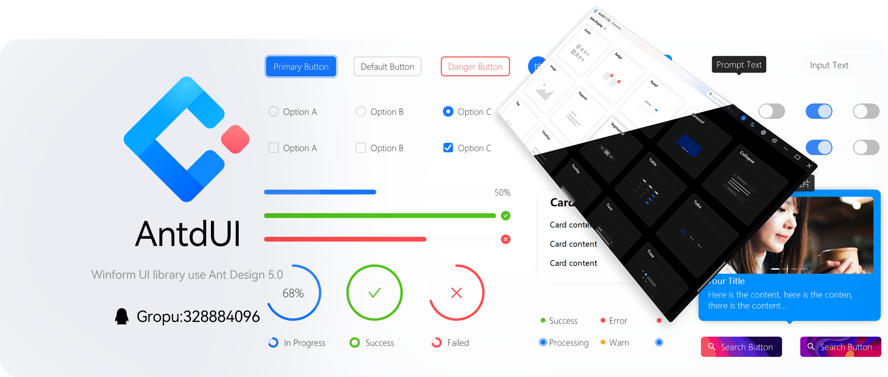
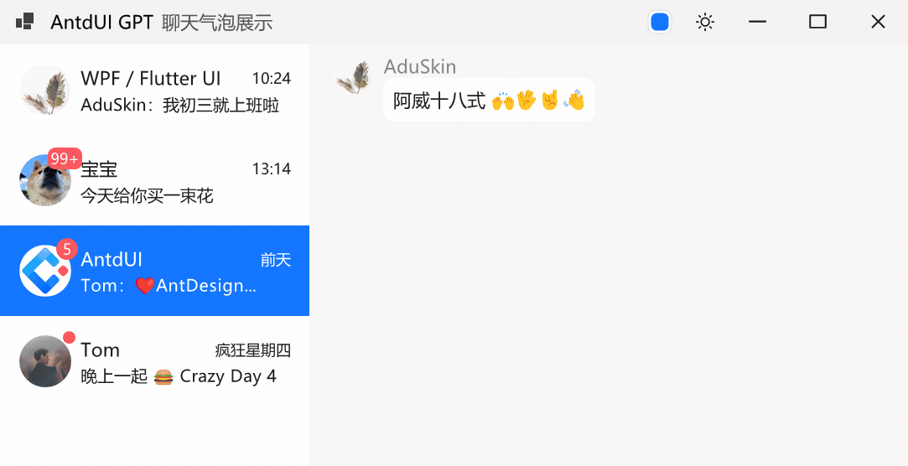

<h1>AntdUI</h1>

[中文](README-zh.md)・English・[Document](doc/wiki/en/Home.md)・[UpdateLog](doc/wiki/en/UpdateLog.md)・[Demo](https://gitee.com/mubaiyanghua/antdui-demo)

### 🦄 Introduce

Ant Design for WinForms, reimagines desktop app aesthetics with modern frontend design elements. Using pure GDI graphics, no image resources required, fully supports AOT.

### ✨ Features

- 🌈 High quality anti aliasing text rendering
- 🎨 Pure GDI vector graphics, comfortable dynamic effects that can be interrupted
- 😍 Emoji breaks the black and white boundaries and adds fun
- 💎 Superior shadow effects on Winforms
- 📦 Borderless window with native window features
- 👚 Theme configuration, black and white mode
- 🌍 Internationale
- 🦜 SVG vector graphics
- 👓 DPI adaptation
- 🦺 AOT Release

### 🖥 Requirements

- .NET 9.0
- .NET 6.0
- .NET Framework4.8
- .NET Framework4.0 and above

### 🌴 Control

⬇️| General `2` | Animation | Disable |
:---:|:--|:--:|:--:|
➡️| [**Button**](doc/wiki/en/Control/Button.md) | ✅ | ✅ |
➡️| [**FloatButton**](doc/wiki/en/Control/FloatButton.md) | ✅ | ❎ |
||||
⬇️| Layout `5` | Animation | Disable |
➡️| [**Divider**](doc/wiki/en/Control/Divider.md) | ❎ | ❎ |
➡️| [**StackPanel**](doc/wiki/en/Control/StackPanel.md) | ❎ | ❎ |
➡️| [**FlowPanel**](doc/wiki/en/Control/FlowPanel.md) | ❎ | ❎ |
➡️| [**GridPanel**](doc/wiki/en/Control/GridPanel.md) | ❎ | ❎ |
➡️| [**Splitter**](doc/wiki/zh/Control/Splitter.md) | ❎ | ❎ |
||||
⬇️| Navigation `7` | Animation | Disable |
➡️| [**Breadcrumb**](doc/wiki/en/Control/Breadcrumb.md) | ✅ | ❎ |
➡️| [**Dropdown**](doc/wiki/en/Control/Dropdown.md) | ✅ | ✅ |
➡️| [**Menu**](doc/wiki/en/Control/Menu.md) | ✅ | ❎ |
➡️| [**PageHeader**](doc/wiki/en/Control/PageHeader.md) | ✅ | ❎ |
➡️| [**TabHeader**](doc/wiki/en/Control/TabHeader.md) | ✅ | ❎ |
➡️| [**Pagination**](doc/wiki/en/Control/Pagination.md) | ✅ | ✅ |
➡️| [**Steps**](doc/wiki/en/Control/Steps.md) | ❎ | ❎ |
||||
⬇️| Data Entry `13` | Animation | Disable |
➡️| [**Checkbox**](doc/wiki/en/Control/Checkbox.md) | ✅ | ✅ |
➡️| [**ColorPicker**](doc/wiki/en/Control/ColorPicker.md) | ✅ | ✅ |
➡️| [**DatePicker**](doc/wiki/en/Control/DatePicker.md) | ✅ | ✅ |
➡️| [**DatePickerRange**](doc/wiki/en/Control/DatePicker.md#datepickerrange) | ✅ | ✅ |
➡️| [**Input**](doc/wiki/en/Control/Input.md) | ✅ | ✅ |
➡️| [**InputNumber**](doc/wiki/en/Control/Input.md#inputnumber) | ✅ | ✅ |
➡️| [**Radio**](doc/wiki/en/Control/Radio.md) | ✅ | ✅ |
➡️| [**Rate**](doc/wiki/en/Control/Rate.md) | ✅ | ❎ |
➡️| [**Select**](doc/wiki/en/Control/Select.md) | ✅ | ✅ |
➡️| [**Slider**](doc/wiki/en/Control/Slider.md) | ✅ | ❎ |
➡️| [**Switch**](doc/wiki/en/Control/Switch.md) | ✅ | ✅ |
➡️| [**TimePicker**](doc/wiki/en/Control/TimePicker.md) | ✅ | ✅ |
➡️| [**UploadDragger**](doc/wiki/en/Control/UploadDragger.md) | ✅ | ❎ |
||||
⬇️| Data Display `18` | Animation | Disable |
➡️| [**Avatar**](doc/wiki/en/Control/Avatar.md) | ❎ | ❎ |
➡️| [**Badge**](doc/wiki/en/Control/Badge.md) | ✅ | ❎ |
➡️| [**Calendar**](doc/wiki/en/Control/Calendar.md) | ✅ | ❎ |
➡️| [**Panel**](doc/wiki/en/Control/Panel.md) | ✅ | ❎ |
➡️| [**Carousel**](doc/wiki/en/Control/Carousel.md) | ✅ | ❎ |
➡️| [**Collapse**](doc/wiki/en/Control/Collapse.md) | ✅ | ❎ |
➡️| [**Preview**](doc/wiki/en/Control/Preview.md) | ✅ | ✅ |
➡️| [**Popover**](doc/wiki/en/Control/Popover.md) | ✅ | ❎ |
➡️| [**Segmented**](doc/wiki/en/Control/Segmented.md) | ✅ | ✅ |
➡️| [**Table**](doc/wiki/en/Control/Table.md) | ✅ | ❎ |
➡️| [**Tabs**](doc/wiki/en/Control/Tabs.md) | ✅ | ❎ |
➡️| [**Tag**](doc/wiki/en/Control/Tag.md) | ✅ | ❎ |
➡️| [**Timeline**](doc/wiki/en/Control/Timeline.md) | ❎ | ❎ |
➡️| [**Tooltip**](doc/wiki/en/Control/Tooltip.md) | ✅ | ❎ |
➡️| [**Tour**](doc/wiki/en/Control/Tour.md) | ✅ | ❎ |
➡️| [**Tree**](doc/wiki/en/Control/Tree.md) | ✅ | ✅ |
➡️| [**Label**](doc/wiki/en/Control/Label.md) | ✅ | ❎ |
➡️| [**LabelTime**](doc/wiki/zh/Control/LabelTime.md) | ✅ | ❎ |
||||
⬇️| Feedback `7` | Animation | Disable |
➡️| [**Alert**](doc/wiki/en/Control/Alert.md) | ✅ | ❎ |
➡️| [**Drawer**](doc/wiki/en/Control/Drawer.md) | ✅ | ❎ |
➡️| [**Message**](doc/wiki/en/Control/Message.md) | ✅ | ❎ |
➡️| [**Modal**](doc/wiki/en/Control/Modal.md) | ✅ | ❎ |
➡️| [**Notification**](doc/wiki/en/Control/Notification.md) | ✅ | ❎ |
➡️| [**Progress**](doc/wiki/en/Control/Progress.md) | ✅ | ❎ |
➡️| [**Spin**](doc/wiki/en/Control/Spin.md) | ✅ | ❎ |
⬇️| Chat `2` | Animation | Disable |
➡️| **MsgList** Friend message list | ✅ | ❎ |
➡️| **ChatList** Chat bubble list | ✅ | ❎ |
||||
⬇️| Other `5` | Animation | Disable |
➡️| [**Battery**](doc/wiki/en/Control/Battery.md) | ✅ | ❎ |
➡️| [**Signal**](doc/wiki/en/Control/Signal.md) | ✅ | ❎ |
➡️| [**Shield**](doc/wiki/en/Control/Shield.md) | ❎ | ❎ |
➡️| [**ContextMenuStrip**](doc/wiki/en/Control/ContextMenuStrip.md) | ✅ | ❎ |
➡️| **Image3D** | ✅ | ❎ |

### 🐿️ Donation

### 🎨 Screenshot

#### ChatUI

> Pure GDI drawing (without inheriting from `TextBox`)

🦦