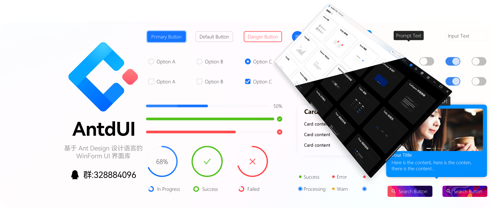
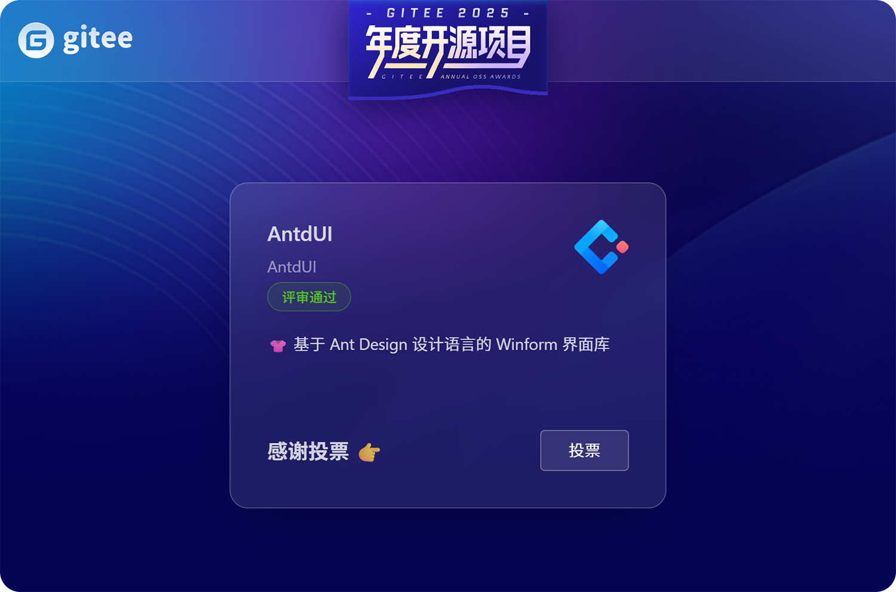

<h1>AntdUI</h1>

中文・[English](README.md)・[文档](doc/wiki/zh/Home.md)・[更新日志](doc/wiki/zh/UpdateLog.md)・[演示](https://gitee.com/mubaiyanghua/antdui-demo)

### 🦄 介绍

基于 Ant Design 设计语言的 WinForm UI 界面库，致力于将现代美观的前端设计风格带入到桌面应用程序中。采用纯GDI绘图，不需任何图片资源，全面支持AOT，最低兼容 `.NET Framework 4.0`

### 🗳️ Gitee 2025 年度开源项目

[🍀 快来给我投票吧！](https://gitee.com/activity/2025opensource?ident=IQOXCY)

> 投票环节于 2026/1/9 结束，每人每个项目只有一票。

### ✨ 特性

- 🌈 高质量抗锯齿文字渲染
- 🎨 纯 GDI 矢量绘图，能打断的舒适动效
- 😍 Emoji 打破黑白界限，增加趣味
- 💎 Winform 上最阴影的阴影效果
- 📦 无边框窗口，拥有原生窗口特性
- 👚 主题配置​，黑白模式
- 🌍 全球化支持
- 🦜 SVG 矢量图
- 👓 DPI 适配
- 🦺 AOT 发布

### 🖥 环境

- .NET 10.0
- .NET 8.0
- .NET Framework4.8
- .NET Framework4.0及以上

### 🌴 控件

⬇️| 通用 `2` | 动画 | 禁用 |
:---:|:--|:--:|:--:|
➡️| [**Button** 按钮](doc/wiki/zh/Control/Button.md) | ✅ | ✅ |
➡️| [**FloatButton** 悬浮按钮](doc/wiki/zh/Control/FloatButton.md) | ✅ | ✅ |
||||
⬇️| 布局 `5` | 动画 | 禁用 |
➡️| [**Divider** 分割线](doc/wiki/zh/Control/Divider.md) | ❎ | ❎ |
➡️| [**StackPanel** 堆栈布局](doc/wiki/zh/Control/StackPanel.md) | ❎ | ❎ |
➡️| [**FlowPanel** 流动布局](doc/wiki/zh/Control/FlowPanel.md) | ❎ | ❎ |
➡️| [**GridPanel** 格栅布局](doc/wiki/zh/Control/GridPanel.md) | ❎ | ❎ |
➡️| [**Splitter** 分隔面板](doc/wiki/zh/Control/Splitter.md) | ❎ | ❎ |
||||
⬇️| 导航 `7` | 动画 | 禁用 |
➡️| [**Breadcrumb** 面包屑](doc/wiki/zh/Control/Breadcrumb.md) | ✅ | ❎ |
➡️| [**Dropdown** 下拉菜单](doc/wiki/zh/Control/Dropdown.md) | ✅ | ✅ |
➡️| [**Menu** 导航菜单](doc/wiki/zh/Control/Menu.md) | ✅ | ✅ |
➡️| [**PageHeader** 页头](doc/wiki/zh/Control/PageHeader.md) | ✅ | ❎ |
➡️| [**TabHeader** 多标签页头](doc/wiki/zh/Control/TabHeader.md) | ✅ | ✅ |
➡️| [**Pagination** 分页](doc/wiki/zh/Control/Pagination.md) | ✅ | ✅ |
➡️| [**Steps** 步骤条](doc/wiki/zh/Control/Steps.md) | ❎ | ❎ |
||||
⬇️| 数据录入 `15` | 动画 | 禁用 |
➡️| [**Checkbox** 多选框](doc/wiki/zh/Control/Checkbox.md) | ✅ | ✅ |
➡️| [**ColorPicker** 颜色选择器](doc/wiki/zh/Control/ColorPicker.md) | ✅ | ✅ |
➡️| [**DatePicker** 日期选择框](doc/wiki/zh/Control/DatePicker.md) | ✅ | ✅ |
➡️| [**DatePickerRange** 日期范围选择框](doc/wiki/zh/Control/DatePicker.md#datepickerrange) | ✅ | ✅ |
➡️| [**Input** 输入框](doc/wiki/zh/Control/Input.md) | ✅ | ✅ |
➡️| [**InputNumber** 数字输入框](doc/wiki/zh/Control/Input.md#inputnumber) | ✅ | ✅ |
➡️| [**Radio** 单选框](doc/wiki/zh/Control/Radio.md) | ✅ | ✅ |
➡️| [**Rate** 评分](doc/wiki/zh/Control/Rate.md) | ✅ | ❎ |
➡️| [**Select** 选择器](doc/wiki/zh/Control/Select.md) | ✅ | ✅ |
➡️| [**Slider** 滑动输入条](doc/wiki/zh/Control/Slider.md) | ✅ | ❎ |
➡️| [**SliderRange** 滑动范围输入条](doc/wiki/zh/Control/Slider.md#sliderrange) | ✅ | ❎ |
➡️| [**Switch** 开关](doc/wiki/zh/Control/Switch.md) | ✅ | ✅ |
➡️| [**TimePicker** 时间选择框](doc/wiki/zh/Control/TimePicker.md) | ✅ | ✅ |
➡️| [**Transfer** 穿梭框](doc/wiki/zh/Control/Transfer.md) | ✅ | ❎ |
➡️| [**UploadDragger** 拖拽上传](doc/wiki/zh/Control/UploadDragger.md) | ✅ | ❎ |
||||
⬇️| 数据展示 `21` | 动画 | 禁用 |
➡️| [**Avatar** 头像](doc/wiki/zh/Control/Avatar.md) | ❎ | ❎ |
➡️| [**Badge** 徽标数](doc/wiki/zh/Control/Badge.md) | ✅ | ❎ |
➡️| [**Calendar** 日历](doc/wiki/zh/Control/Calendar.md) | ✅ | ❎ |
➡️| [**Panel** 面板](doc/wiki/zh/Control/Panel.md) | ✅ | ❎ |
➡️| [**Carousel** 走马灯](doc/wiki/zh/Control/Carousel.md) | ✅ | ❎ |
➡️| [**Collapse** 折叠面板](doc/wiki/zh/Control/Collapse.md) | ✅ | ❎ |
➡️| [**Preview** 图片预览](doc/wiki/zh/Control/Preview.md) | ✅ | ❎ |
➡️| [**ImagePreview** 图片预览](doc/wiki/zh/Control/ImagePreview.md) | ✅ | ❎ |
➡️| [**Popover** 气泡卡片](doc/wiki/zh/Control/Popover.md) | ✅ | ❎ |
➡️| [**Segmented** 分段控制器](doc/wiki/zh/Control/Segmented.md) | ✅ | ✅ |
➡️| [**Table** 表格](doc/wiki/zh/Control/Table.md) | ✅ | ✅ |
➡️| [**Tabs** 标签页](doc/wiki/zh/Control/Tabs.md) | ✅ | ✅ |
➡️| [**Tag** 标签](doc/wiki/zh/Control/Tag.md) | ✅ | ❎ |
➡️| [**Timeline** 时间轴](doc/wiki/zh/Control/Timeline.md) | ❎ | ❎ |
➡️| [**Tooltip** 文字提示](doc/wiki/zh/Control/Tooltip.md) | ✅ | ❎ |
➡️| [**Tree** 树形控件](doc/wiki/zh/Control/Tree.md) | ✅ | ✅ |
➡️| [**Tour** 漫游式引导](doc/wiki/zh/Control/Tour.md) | ✅ | ❎ |
➡️| [**Label** 文本](doc/wiki/zh/Control/Label.md) | ✅ | ❎ |
➡️| [**LabelTime** 时间文本](doc/wiki/zh/Control/LabelTime.md) | ✅ | ❎ |
➡️| [**HyperlinkLabel** 超链接文本](doc/wiki/zh/Control/HyperlinkLabel.md) | ✅ | ❎ |
➡️| **Chart** 图表 | ✅ | ❎ |
||||
⬇️| 反馈 `8` | 动画 | 禁用 |
➡️| [**Alert** 警告提示](doc/wiki/zh/Control/Alert.md) | ✅ | ❎ |
➡️| [**Drawer** 抽屉](doc/wiki/zh/Control/Drawer.md) | ✅ | ❎ |
➡️| [**Message** 全局提示](doc/wiki/zh/Control/Message.md) | ✅ | ❎ |
➡️| [**Modal** 对话框](doc/wiki/zh/Control/Modal.md) | ✅ | ❎ |
➡️| [**Notification** 通知提醒框](doc/wiki/zh/Control/Notification.md) | ✅ | ❎ |
➡️| [**Progress** 进度条](doc/wiki/zh/Control/Progress.md) | ✅ | ❎ |
➡️| [**Spin** 加载中](doc/wiki/zh/Control/Spin.md) | ✅ | ❎ |
➡️| [**Watermark** 水印](doc/wiki/zh/Control/Watermark.md) | ✅ | ❎ |
||||
⬇️| 聊天 `2` | 动画 | 禁用 |
➡️| **MsgList** 好友消息列表 | ✅ | ❎ |
➡️| **ChatList** 气泡聊天列表 | ✅ | ❎ |
||||
⬇️| 其他 `5` | 动画 | 禁用 |
➡️| [**Battery** 电量](doc/wiki/zh/Control/Battery.md) | ✅ | ❎ |
➡️| [**Signal** 信号强度](doc/wiki/zh/Control/Signal.md) | ✅ | ❎ |
➡️| [**Shield** 徽章](doc/wiki/zh/Control/Shield.md) | ❎ | ❎ |
➡️| [**ContextMenuStrip** 右键菜单](doc/wiki/zh/Control/ContextMenuStrip.md) | ✅ | ❎ |
➡️| **Image3D** 图片3D | ✅ | ❎ |

### 🐿️ 捐赠

### 🎨 截图

#### ChatUI

> 纯GDI，不是TextBox等拖控件

## 📢 特别声明

AntdUI 项目已加入 [dotNET China](https://gitee.com/dotnetchina)  组织。 

🦦 招募小伙伴一起维护项目