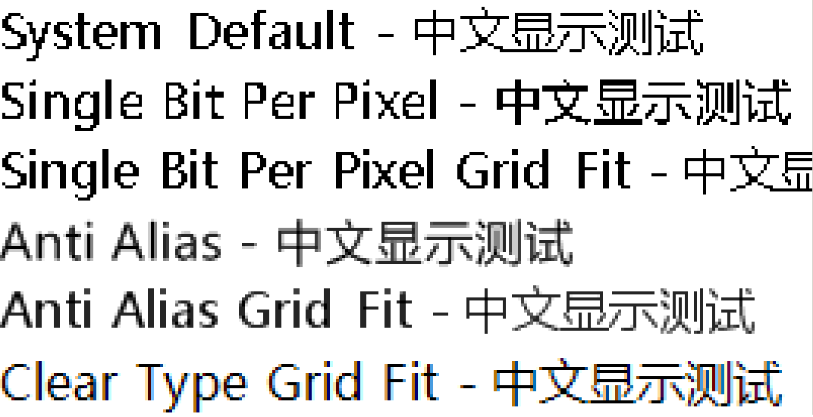

[Home](Home.md)・[UpdateLog](UpdateLog.md)・[Config](Config.md)・[Theme](Theme.md)d)

### There are five types of font rendering in Windows：

* SingleBitPerPixel
* SingleBitPerPixelGridFit
* AntiAlias
* AntiAliasGridFit
* ClearTypeGridFit

What is the difference between them?

---

#### SingleBitPerPixel

The System Default in my system is actually `SingleBitPerPixelGridFit`, which has the same display effect. Black fonts are displayed in black without interpolation. Of course, the `SingleBitPerPixel` method also does not interpolate. The difference between the two is that `Grid Fit` is grid corrected, so the displayed font is more polished. You can take a look at the "宋体", which has the best display effect at 12 o'clock size.

#### AntiAlias

`AntiAlias` is anti aliasing, and the actual rendered result will be interpolated, with black fonts being inserted into gray pixels.

#### AntiAliasGridFit

`AntiAliasGridFit` is an enhanced version of `AntiAlias`, which has been grid corrected for better display effects.

#### ClearTypeGridFit

`ClearTypeGridFit` is different from the interpolation mentioned above. It can be seen that black text may be interpolated with light blue, earthy yellow, and other pixels, which can make the font appear blurry and less sharp. However, it is more suitable for display on high DPI devices and is currently the most popular rendering method.

### Summary:

`ClearTypeGridFit` is the most popular, and the higher the DPI of the monitor, the better the display effect of ClearType.

`AntiAlias` is relatively smoother