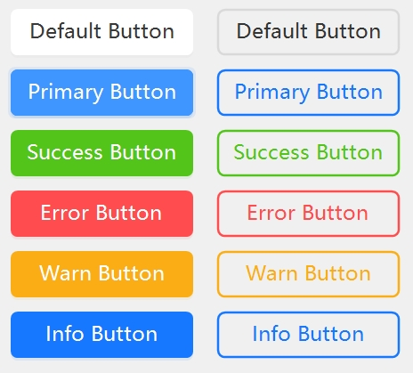
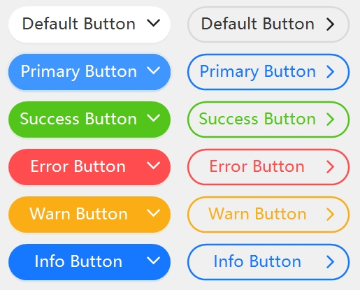

[Home](../Home.md)・[UpdateLog](../UpdateLog.md)・[Config](../Config.md)・[Theme](../Theme.md)

## Button
👚

> To trigger an operation.

- DefaultProperty：Text
- DefaultEvent：Click

### Property

Name | Description | Type | Default Value |
:--|:--|:--|:--|
**OriginalBackColor** | Original background color | Color | Transparent |
||||
**AutoSize** | Auto Size | bool | false |
**AutoSizeMode** | Auto size mode | [TAutoSize](Enum.md#tautosize) | None |
**DisplayStyle** | Specify to display image or text | [TButtonDisplayStyle](Enum.md#tbuttondisplaystyle) | Default |
||||
**ForeColor** | Text color | Color`?` | `null` |
**ForeHover** | Hover text color | Color`?` | `null` |
**ForeActive** | Active text color | Color`?` | `null` |
**BackColor** | Background color | Color`?` | `null` |
**BackExtend** | Background gradient color | string`?` | `null` |
**BackHover** | Hover background color | Color`?` | `null` |
**BackActive** | Activate background color | Color`?` | `null` |
||||
**DefaultBack** | Default type background color | Color`?` | `null` |
**DefaultBorderColor** | Default type border color | Color`?` | `null` |
||||
**BackgroundImage** | Background image | Image`?` | `null` |
**BackgroundImageLayout** | Background image layout | [TFit](Enum.md#tfit) | Fill |
||||
**BorderWidth** | Border width | float | 0F |
||||
**WaveSize** | Wave size `Click animation` | int | 4 |
**Radius** | Rounded corners | int | 6 |
**Shape** | Shape | [TShape](Enum.md#tshape) | Default |
**Type** | Type | [TTypeMini](Enum.md#ttypemini) | Default |
**Ghost** | Ghost attribute `Transparent button background` | bool | false |
**RespondRealAreas** | Response button real area | bool | false |
**ShowArrow** | Display arrows | bool | false |
**IsLink** | Arrow Link Style | bool | false |
**UseMnemonic** | Mnemonic key `The first character with (&) will be used as the mnemonic key` | bool | true |
||||
**Text** | Text | string`?` | `null` |
🌏 **LocalizationText** | International Text | string`?` | `null` |
**TextAlign** | Text position | ContentAlignment | MiddleCenter |
**VirtualWidth** | Virtual width | int`?` | `null` |
**AutoEllipsis** | Text exceeds automatic processing | bool | false |
**TextMultiLine** | Multiple lines | bool | false |
**TextCenterHasIcon** | Text centered display(After including icons) | bool | false |
||||
**IconRatio** | Icon Scale | float | 0.7F |
**IconGap** | Ratio of icon to text spacing | float | 0.25F |
**Icon** | Icon | Image`?` | `null` |
**IconSvg** | Icon SVG | string`?` | `null` |
**IconHover** | Hover icon | Image`?` | `null` |
**IconHoverSvg** | Hover icon SVG | string`?` | `null` |
**IconHoverAnimation** | Hover icon animation duration | int | 200 |
**IconPosition** | Location of button icon components | [TAlignMini](Enum.md#talignmini) | Left |
**IconSize** | Icon size `Default automatic size` | Size | 0 × 0 |
||||
|**Switch**||
**AutoToggle** | Auto toggle state on click | bool | false |
**Toggle** | Toggle state | bool | false |
**ToggleIcon** | Toggle icon | Image`?` | `null` |
**ToggleIconSvg** | Toggle icon SVG | string`?` | `null` |
**ToggleIconHover** | Toggle Hover icon | Image`?` | `null` |
**ToggleIconHoverSvg** | Toggle Hover icon SVG | string`?` | `null` |
**IconToggleAnimation** | Icon toggling animation duration | int | 200 |
**ToggleFore** | Toggle text color | Color`?` | `null` |
**ToggleForeHover** | Toggle hover text color | Color`?` | `null` |
**ToggleForeActive** | Toggle active text color | Color`?` | `null` |
**ToggleType** | Toggle type | [TTypeMini](Enum.md#ttypemini)`?` | `null` |
**ToggleBack** | Toggle background color | Color`?` | `null` |
**ToggleBackExtend** | Toggle background gradient color | string`?` | `null` |
**ToggleBackHover** | Toggle hover background color | Color`?` | `null` |
**ToggleBackActive** | Toggle to activate background color | Color`?` | `null` |
||||
|**Loading**||
**Loading** | Loading State `true Block clicks` | bool | false |
**LoadingRespondClick** | Loading respond click | bool | false |
**LoadingValue** | Loading progress `0F-1F` | float | 0.3F |
**LoadingWaveValue** | Water wave progress `0F-1F` | float | 0F |
**LoadingWaveColor** | Water wave color | Color`?` | `null` |
**LoadingWaveVertical** | Is the water wave vertical | bool | false |
**LoadingWaveSize** | Water wave size | int | 2 |
**LoadingWaveCount** | Number of water waves | int | 1 |
||||
|**State**||
**ExtraMouseDown** | Active state | bool | false |
**ExtraMouseHover** | Hover state | bool | false |
||||
|**Combination**||
**JoinMode** | Combination mode | [TJoinMode](Enum.md#tjoinmode) | None |
**JoinLeft** | Connect left area | bool | false |
**JoinRight** | Connect right area | bool | false |

- Button type `Type` right`Ghost=true` `BorderWidth=2F`

- Rounded button `Shape=TShape.Round` right`ShowArrow=true` `IsLink=true`
