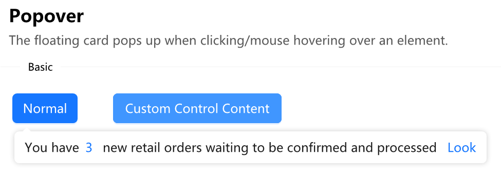

[Home](../Home.md)・[UpdateLog](../UpdateLog.md)・[Config](../Config.md)・[Theme](../Theme.md)

## Popover

> The floating card pops up when clicking/mouse hovering over an element.

### Popover.Config

> Configure Popover

Name | Description | Type | Default Value |
:--|:--|:--|:--|
**Control** | Belonging Control | Form | `Required` |
**Title** | Title | string |`null`|
**Content** | Control/Content | object |`Required`|
**Font** | Font | Font |`null`|
**AutoClose** |Automatic shutdown time(s) `0 equals not closing` | int |0|
**Radius** | Rounded corners | int | 6 |
**ArrowAlign** | Arrow direction | [TAlign](Enum.md#talign) | Bottom |
**ArrowSize** | Arrow size | int | 8 |
**Offset** | Offset | Rectangle / RectangleF | `null` |
**CustomPoint** 🔴 | Custom Location | Rectangle`?` |`null`|
**Focus** 🔴 | Get Focus | bool | true |
**Tag** | User defined data | object`?` | `null` |
||||
**OnControlLoad** | Callback after the control is displayed | `Action?` | `null` |

### Popover.TextRow

> Multiple column text `Using arrays/collections to give content` 
> Used for displaying text or interactive links of multiple colors in a single line 
> ```csharp
> AntdUI.Popover.open(button1, new AntdUI.Popover.TextRow[] {
>     new AntdUI.Popover.TextRow("You have"),
>     new AntdUI.Popover.TextRow("3", 2, AntdUI.Style.Db.Primary),
>     new AntdUI.Popover.TextRow("new retail orders waiting to be confirmed and processed"),
>     new AntdUI.Popover.TextRow("Look", 2, AntdUI.Style.Db.Primary) {
>         Call = () => {
>             MessageBox.Show("Click to look");
>         }
>     },
> }, AntdUI.TAlign.BL);
> ```

Name | Description | Type | Default Value |
:--|:--|:--|:--|
**Text** | Text | string | `Required` |
**Gap** | Gap `Left and right spacing` | int | 0 |
||||
**Fore** | Text color | Color`?` | `null` |
**Font** | Font | Font`?` | `null` |
||||
**Call** | Click on callback `Mouse clickable` | Action | `null` |

***

### UserControl Monitoring Load Example

~~~csharp
public partial class UserControl1 : UserControl, AntdUI.ControlEvent
{
    public void LoadCompleted()
    {
        System.Diagnostics.Debug.WriteLine("Load");
    }

    protected override void Dispose(bool disposing)
    {
        base.Dispose(disposing);
        System.Diagnostics.Debug.WriteLine("Close");
    }
}
~~~