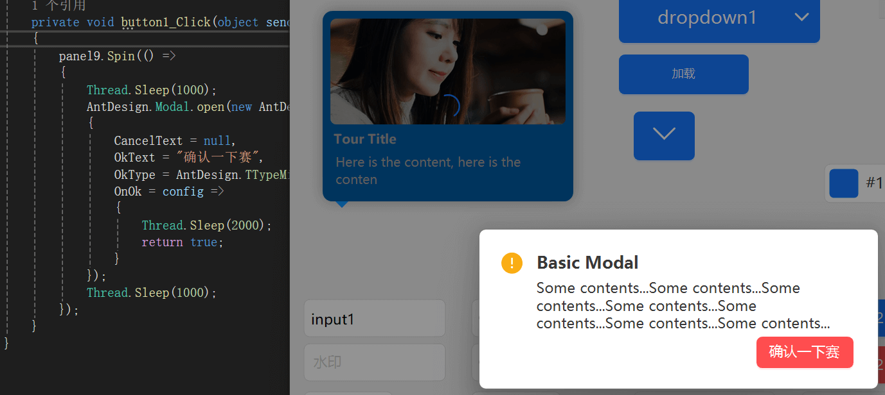

[Home](../Home.md)・[UpdateLog](../UpdateLog.md)・[Config](../Config.md)・[Theme](../Theme.md)

## Spin
👚

> Used for the loading status of a page or a block.

- DefaultProperty：Text
- DefaultEvent：Click

### Property

Name | Description | Type | Default Value |
:--|:--|:--|:--|
**Text** | Text | string`?` | `null` |
🌏 **LocalizationText** | International Text | string`?` | `null` |
**Fill** | Colour | Color`?` | `null` |
**ForeColor** | Text color | Color`?` | `null` |

### Method

> All `IControl` that inherit FHIR trol support the `Spin` method

Name | Description | Return Value | Parameters |
:--|:--|:--|:--|
**Spin** | LOADING | void | Action action `Commission to wait for`, Action? end = null `Post completion callback` |
**Spin** | LOADING | void | [Spin.Config](#spin.config) `Config`, Action action `Commission to wait for`, Action? end = null `Post completion callback` |

### Config

#### Spin.Config

Name | Description | Type | Default Value |
:--|:--|:--|:--|
**Text** | Text | string`?` | `null` |
**Back** | Background color | Color`?` | `null` |
**Color** | Colour | Color`?` | `null` |
**Fore** | Text color | Color`?` | `null` |
**Radius** | Rounded corners | int`?` | `null` |
**Font** | Font | Font`?` | `null` |
**Value** | Progress | float`?` | `null` |

***

### Code Example

```csharp
panel1.Spin(config => {
    // Time consuming code
    sleep(1000);
},()=>{
    //Loading completed
});
```

```csharp
AntdUI.Spin.open(panel1, config => {
    // Time consuming code
    sleep(1000);
},()=>{
    //Loading completed
});
```

