📚 **AntdUI** Documentation

> Interface library based on [dotnet Winforms](https://github.com/dotnet/winforms)

[中文](../zh/Home.md)・English・[UpdateLog](UpdateLog.md)

- [**Install** Introduction to Interface Library](Install.md)
- [**DPI** High resolution blur/unclear font appearance](DPI.md)
- [**Config** Global Configuration](Config.md)
- [**Theme** Light and dark color mode custom theme](Theme.md)
- [**SVG**](SVG.md)
- [**AOT**](AOT.md)

---

## 🧰 Control

### General `2`

#### [Button](Control/Button.md)

#### [FloatButton](Control/FloatButton.md)

### Layout `5`

#### [Divider](Control/Divider.md)

#### [StackPanel](Control/StackPanel.md)
[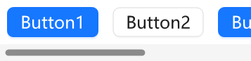](Control/StackPanel.md)

#### [FlowPanel](Control/FlowPanel.md)
[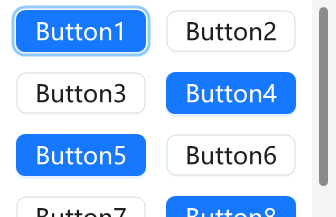](Control/FlowPanel.md)

#### [GridPanel](Control/GridPanel.md)
[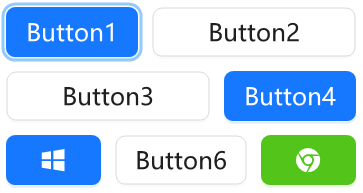](Control/GridPanel.md)

#### [Splitter](Control/Splitter.md)

### Navigation `7`

#### [Breadcrumb](Control/Breadcrumb.md)

#### [Dropdown](Control/Dropdown.md)
[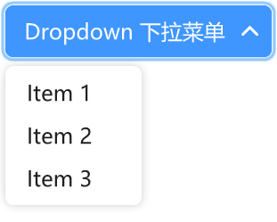](Control/Dropdown.md)

#### [Menu](Control/Menu.md)
[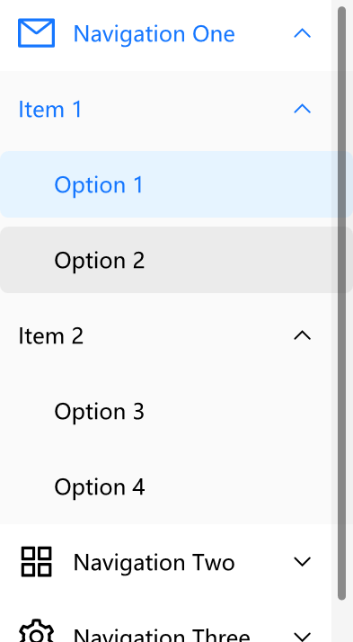](Control/Menu.md)

#### [PageHeader](Control/PageHeader.md)

#### [TabHeader](Control/TabHeader.md)
[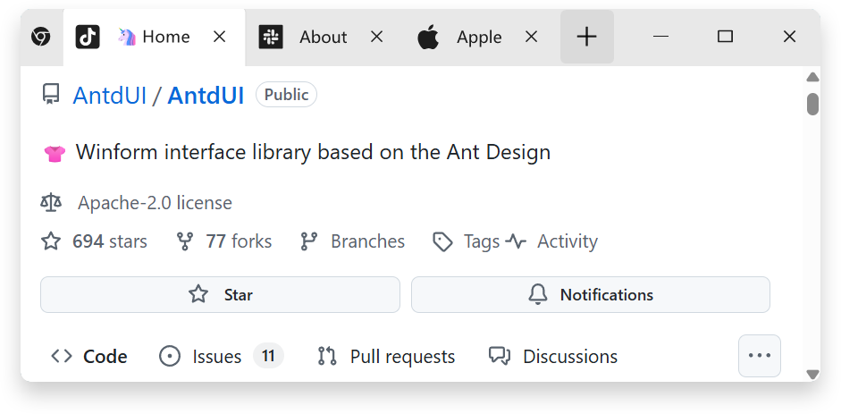](Control/TabHeader.md)

#### [Pagination](Control/Pagination.md)

#### [Steps](Control/Steps.md)
[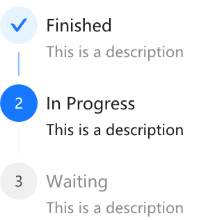](Control/Steps.md)

### Data Entry `13`

#### [Checkbox](Control/Checkbox.md)

#### [ColorPicker](Control/ColorPicker.md)
[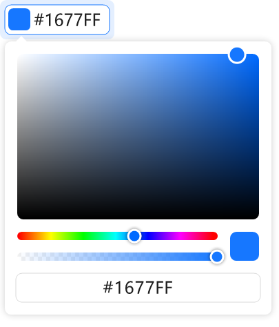](Control/ColorPicker.md)

#### [DatePicker](Control/DatePicker.md)

#### [DatePickerRange](Control/DatePicker.md#datepickerrange)

#### [Input](Control/Input.md)
[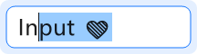](Control/Input.md)

#### [InputNumber](Control/Input.md#inputnumber)
[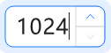](Control/Input.md#inputnumber)

#### [Radio](Control/Radio.md)

#### [Rate](Control/Rate.md)

#### [Select](Control/Select.md)
[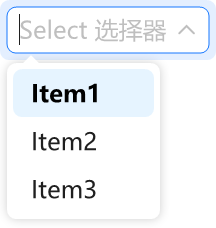](Control/Select.md)

#### [Slider](Control/Slider.md)

#### [SliderRange](Control/Slider.md#sliderrange)

#### [Switch](Control/Switch.md)

#### [TimePicker](Control/TimePicker.md)
[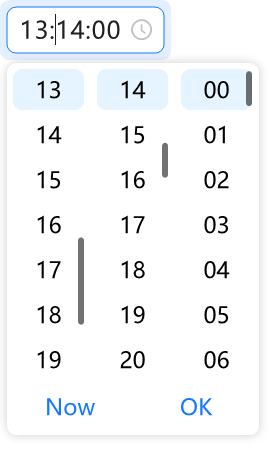](Control/TimePicker.md)

#### [UploadDragger](Control/UploadDragger.md)
[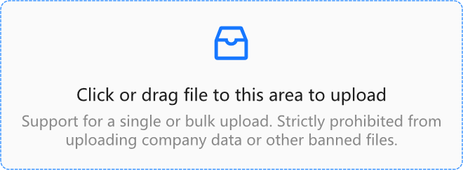](Control/UploadDragger.md)

### Data Display `18`

#### [Avatar](Control/Avatar.md)

#### [Badge](Control/Badge.md)
[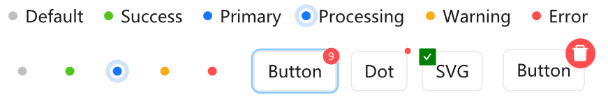](Control/Badge.md)

#### [Calendar](Control/Calendar.md)
#### [Panel](Control/Panel.md)

#### [Carousel](Control/Carousel.md)
[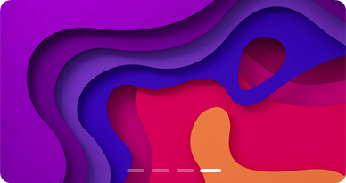](Control/Carousel.md)

#### [Collapse](Control/Collapse.md)
[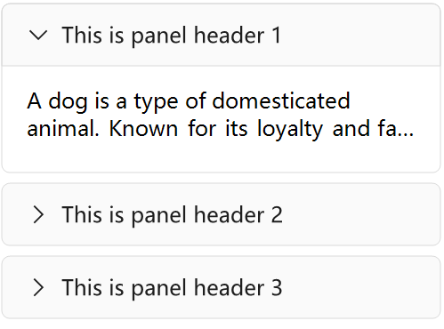](Control/Collapse.md)

#### [Preview](Control/Preview.md)

#### [Popover](Control/Popover.md)

#### [Segmented](Control/Segmented.md)
[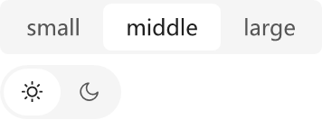](Control/Segmented.md)

#### [Table](Control/Table.md)
[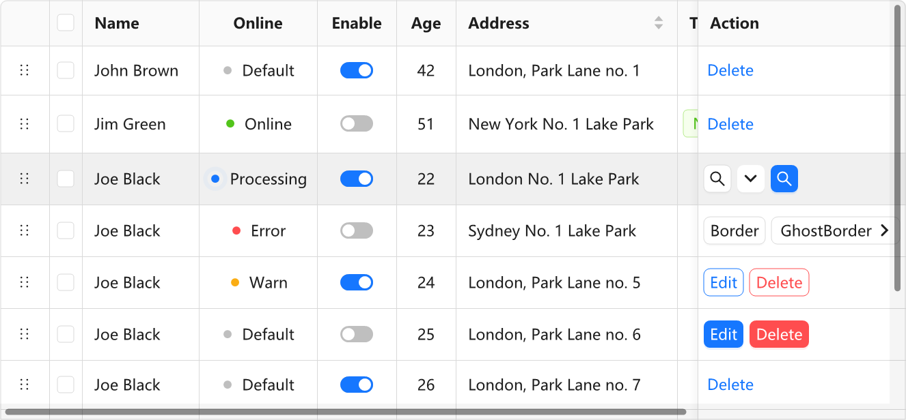](Control/Table.md)

#### [Tabs](Control/Tabs.md)
[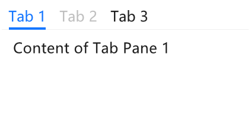](Control/Tabs.md)

#### [Tag](Control/Tag.md)
[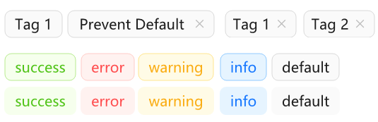](Control/Tag.md)

#### [Timeline](Control/Timeline.md)
[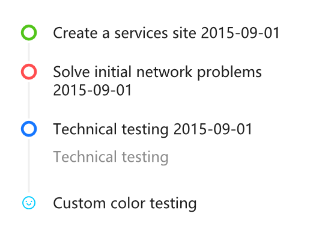](Control/Timeline.md)

#### [Tooltip](Control/Tooltip.md)

#### [Tree](Control/Tree.md)
[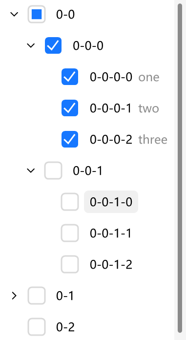](Control/Tree.md)

#### [Tour](Control/Tour.md)
#### [Label](Control/Label.md)
#### [LabelTime](Control/LabelTime.md)
[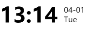](Control/LabelTime.md)

### Feedback `7`

#### [Alert](Control/Alert.md)
[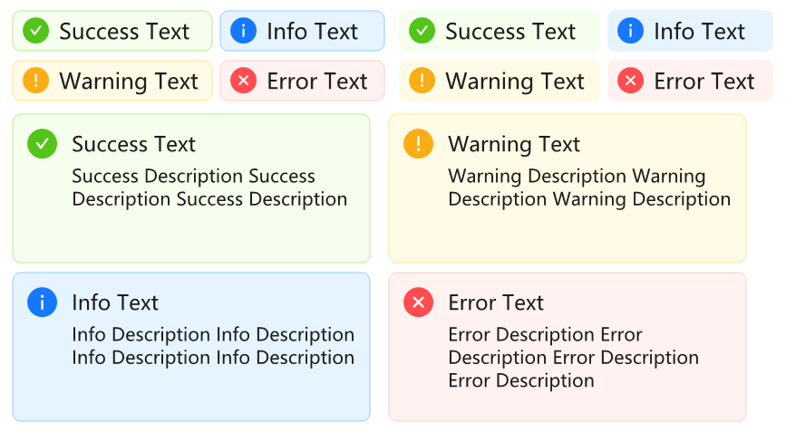](Control/Alert.md)

#### [Drawer](Control/Drawer.md)
#### [Message](Control/Message.md)
[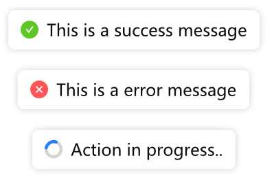](Control/Message.md)

#### [Modal](Control/Modal.md)
[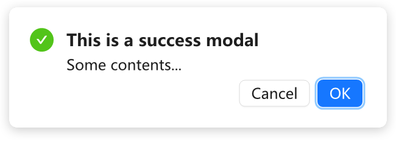](Control/Modal.md)

#### [Notification](Control/Notification.md)

#### [Progress](Control/Progress.md)
[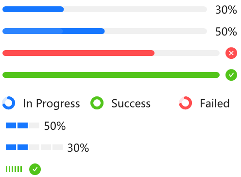](Control/Progress.md)

#### [Spin](Control/Spin.md)
[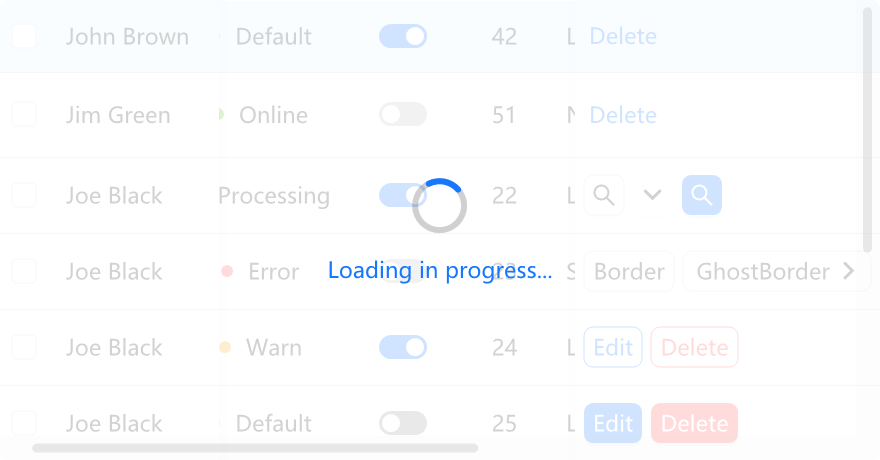](Control/Spin.md)

### Other `5`

#### ~~[WindowBar](Control/WindowBar.md)~~

> ⚠ Removed using [PageHeader](Control/PageHeader.md) replacement

#### [Battery](Control/Battery.md)

#### [Signal](Control/Signal.md)
[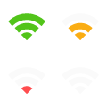](Control/Signal.md)

#### [Shield](Control/Shield.md)

#### [ContextMenuStrip](Control/ContextMenuStrip.md)
[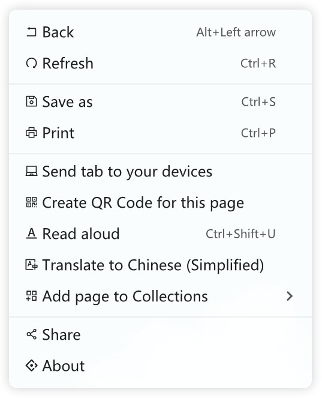](Control/ContextMenuStrip.md)

#### [Image3D](Control/Image3D.md)
[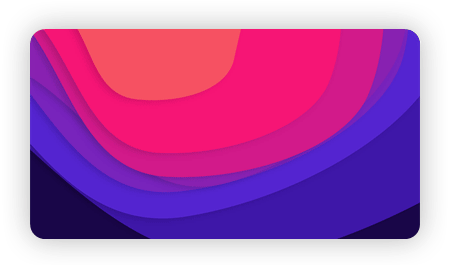](Control/Image3D.md)

---

## 🪟 Form

#### [Window](Form/Window.md)
#### [BorderlessForm](Form/BorderlessForm.md)
#### [BaseForm](Form/BaseForm.md)