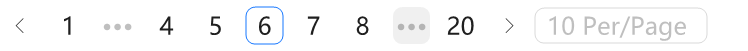
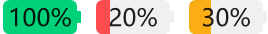

# 📚 AntdUI Documentation

> Interface library based on [dotnet Winforms](https://github.com/dotnet/winforms)

[中文](../zh/Home.md)・English・[UpdateLog](UpdateLog.md)

## 🎯 Guide

- [**Install** - Introduction to Interface Library](Install.md)
- [**DPI** - High resolution blur/unclear font appearance](DPI.md)
- [**Config** - Global Configuration](Config.md)
- [**Theme** - Light and dark color mode custom theme](Theme.md)
- [**SVG**](SVG.md)
- [**AOT**](AOT.md)

---

## 🧰 Control

| General `2` | Description |
| --- | --- |
| [Button](Control/Button.md) | To trigger an operation. |
| Example |  |
| [FloatButton](Control/FloatButton.md) | A button that floats at the top of the page. |
| Example |  |

| Layout `5` | Description |
| --- | --- |
| [Divider](Control/Divider.md) | A divider line separates different content. |
| Example |  |
| [StackPanel](Control/StackPanel.md) | Arranging sub elements horizontally or vertically. |
| Example |  |
| [FlowPanel](Control/FlowPanel.md) | Arrange sub elements by row, automatically wrap lines. |
| Example |  |
| [GridPanel](Control/GridPanel.md) | Grid layout container with precise division of areas. |
| Example |  |
| [Splitter](Control/Splitter.md) | Split panels to isolate |
| Example |  |

| Navigation `7` | Description |
| --- | --- |
| [Breadcrumb](Control/Breadcrumb.md) | Display the current location within a hierarchy. And allow going back to states higher up in the hierarchy. |
| Example |  |
| [Dropdown](Control/Dropdown.md) | A dropdown list. |
| Example |  |
| [Menu](Control/Menu.md) | A versatile menu for navigation. |
| Example |  |
| [PageHeader](Control/PageHeader.md) | A page header serves as a content overview and guides page level operations. |
| Example |  |
| [TabHeader](Control/TabHeader.md) | Multi tab page switching header |
| Example |  |
| [Pagination](Control/Pagination.md) | A long list can be divided into several pages, and only one page will be loaded at a time. |
| Example |  |
| [Steps](Control/Steps.md) | A navigation bar that guides users through the steps of a task. |
| Example |  |

| Data Entry `13` | Description |
| --- | --- |
| [Checkbox](Control/Checkbox.md) | Collect user's choices. |
| Example |  |
| [ColorPicker](Control/ColorPicker.md) | Used for color selection. |
| Example |  |
| [DatePicker](Control/DatePicker.md) | To select or input a date. |
| Example |  |
| [DatePickerRange](Control/DatePicker.md#datepickerrange) | Control for entering or selecting a date range. |
| Example |  |
| [Input](Control/Input.md) | Through mouse or keyboard input content, it is the most basic form field wrapper. |
| Example |  |
| [InputNumber](Control/Input.md#inputnumber) | Enter a number within certain range with the mouse or keyboard. |
| Example |  |
| [Radio](Control/Radio.md) | Used to select a single state from multiple options. |
| Example |  |
| [Rate](Control/Rate.md) | Used for rating operation on something. |
| Example |  |
| [Select](Control/Select.md) | A dropdown menu for displaying choices. |
| Example |  |
| [Slider](Control/Slider.md) | A Slider component for displaying current value. |
| Example |  |
| [SliderRange](Control/Slider.md#sliderrange) | A Slider component for displaying current value and intervals in range. |
| Example |  |
| [Switch](Control/Switch.md) | Used to toggle between two states. |
| Example |  |
| [TimePicker](Control/TimePicker.md) | To select/input a time. |
| Example |  |
| [UploadDragger](Control/UploadDragger.md) | Support drag and drop file upload components |
| Example |  |

| Data Display `18` | Description |
| --- | --- |
| [Avatar](Control/Avatar.md) | Used to represent users or things, supporting the display of images, icons, or characters. |
| Example |  |
| [Badge](Control/Badge.md) | Small numerical value or status descriptor for UI elements. |
| Example |  |
| [Calendar](Control/Calendar.md) | A container that displays data in calendar form. |
| Example |  |
| [Panel](Control/Panel.md) | A container for displaying information. |
| Example |  |
| [Carousel](Control/Carousel.md) | A set of carousel areas. |
| Example |  |
| [Collapse](Control/Collapse.md) | A content area which can be collapsed and expanded. |
| Example |  |
| [Preview](Control/Preview.md) | Picture preview box. |
| Example |  |
| [Popover](Control/Popover.md) | The floating card pops up when clicking/mouse hovering over an element. |
| Example |  |
| [Segmented](Control/Segmented.md) | Display multiple options and allow users to select a single option. |
| Example |  |
| [Table](Control/Table.md) | A table displays rows of data. |
| Example |  |
| [Tabs](Control/Tabs.md) | Tabs make it easy to explore and switch between different views. |
| Example |  |
| [Tag](Control/Tag.md) | Used for marking and categorization. |
| Example |  |
| [Timeline](Control/Timeline.md) | Vertical display timeline. |
| Example |  |
| [Tooltip](Control/Tooltip.md) | Simple text popup box. |
| Example |  |
| [Tree](Control/Tree.md) | Multiple-level structure list. |
| Example |  |
| [Tour](Control/Tour.md) | A popup component for guiding users through a product. |
| Example |  |
| [Label](Control/Label.md) | Display a paragraph of text. |
| Example | |
| [LabelTime](Control/LabelTime.md) | Display time text. |
| Example |  |

| Feedback `7` | Description |
| --- | --- |
| [Alert](Control/Alert.md) | Display warning messages that require attention. |
| Example |  |
| [Drawer](Control/Drawer.md) | A panel that slides out from the edge of the screen. |
| Example |  |
| [Message](Control/Message.md) | Display global messages as feedback in response to user operations. |
| Example |  |
| [Modal](Control/Modal.md) | Display a modal dialog box, providing a title, content area, and action buttons. |
| Example |  |
| [Notification](Control/Notification.md) | Prompt notification message globally. |
| Example |  |
| [Progress](Control/Progress.md) | Display the current progress of the operation. |
| Example |  |
| [Spin](Control/Spin.md) | Used for the loading status of a page or a block. |
| Example |  |

| Other `5` | Description |
| --- | --- |
| ~~[WindowBar](Control/WindowBar.md)~~ | ⚠ Removed using [PageHeader](Control/PageHeader.md) replacement |
| [Battery](Control/Battery.md) | Display device battery level. |
| Example |  |
| [Signal](Control/Signal.md) | Display device signals. |
| Example |  |
| [Shield](Control/Shield.md) | Concise, consistent, and legible badges. |
| Example |  |
| [ContextMenuStrip](Control/ContextMenuStrip.md) | Right click on the current page at will |
| Example |  |
| [Image3D](Control/Image3D.md) | used to display 3D effect images |
| Example |  |

---

## 🪟 Form

| Form `3` | Description |
| --- | --- |
| [Window](Form/Window.md) | Native feature window `Hide title bar` |
| [BorderlessForm](Form/BorderlessForm.md) | Borderless window `GDI shadow` |
| [BaseForm](Form/BaseForm.md) | DPI Basic Window |