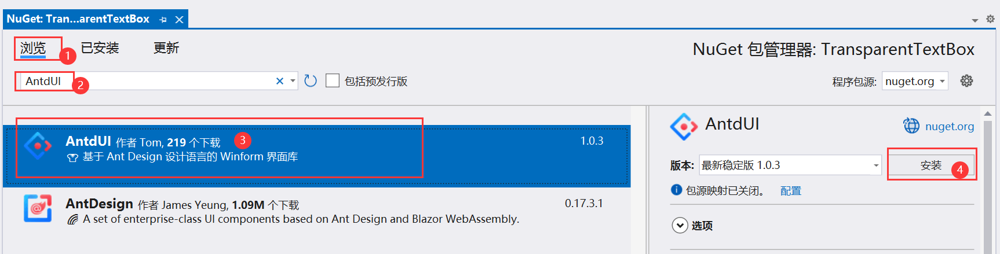
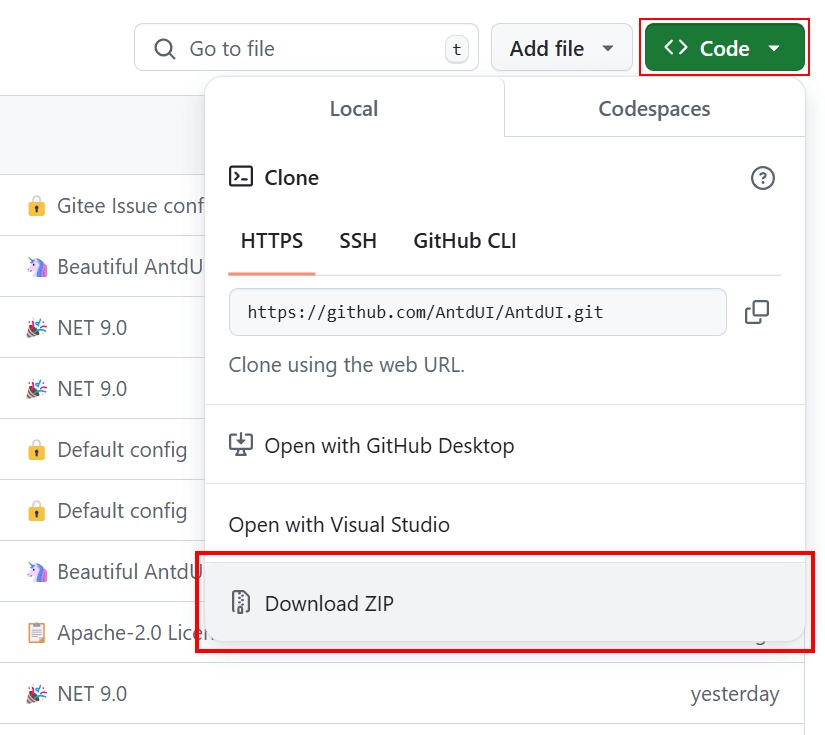

📖 **AntdUI** Ant Design UI

[中文](../zh/Home.md)・English・[UpdateLog](UpdateLog.md)・[Config](Config.md)・[Theme](Theme.md)・[SVG](SVG.md)

Interface library based on [dotnet Winforms](https://github.com/dotnet/winforms)

<strong>Install</strong>

### NuGet Installation

> 👏 Recommending NuGet for swift installation

#### Visual Studio Visual Installation

#### PM command installation
PM> `Install-Package AntdUI`

---

### Source Code Download

> Access the official code repository of AntdUI at ：[https://github.com/AntdUI/AntdUI](https://github.com/AntdUI/AntdUI)

Unzip, launch `AntdUI.sln` and set `examples/Demo` as startup project. `F5` run.

#### Compilation Issues?

> Ensure you have **Visual Studio 2022** or above for compilation.

[Consider installing older versions (like.NET Framework 4.0 and 4.5) of Visual Studio if needed](InstallOldVersionFramework.md)

#### Toolbox Absence?

Modify `AntdUI.csproj` `TargetFrameworks` to retain only your project's framework version and regenerate.

> Still Not Displaying? Restart VS to refresh and recompile repeatedly to ensure latest DLLs are used.

---

Precautions

#### Source code download cannot compile ❓

The compiler requires **Visual Studio 2022** and above, with [Visual Studio installed with older versions (. NET Framework 4.0 and 4.5)](InstallOldVersionFramework.md)

####

#### Why are the windows in the designer not fully displayed ❓

HDPI issue, **100% scaling should be used to design the interface**
- Use CMD `devenv.exe /noScale`
- 👏 [Fix HDPI/scaling issues with Windows Forms Designer in Visual Studio](https://learn.microsoft.com/en-us/visualstudio/designers/disable-dpi-awareness?view=vs-2022) `<ForceDesignerDpiUnaware>true</ForceDesignerDpiUnaware>`
- Right click on the desktop to display settings and zoom to `100%`

####

#### How do I enable DPI support ❓

CORE can easily solve applications [Application.SetHighDpiMode(HighDpiMode.SystemAware)](https://learn.microsoft.com/en-us/dotnet/api/system.windows.forms.application.sethighdpimode?view=windowsdesktop-8.0)；`Framework`, high DPI support in Windows Forms needs to be enabled through a checklist [High DPI support in Windows Forms](https://learn.microsoft.com/en-us/dotnet/desktop/winforms/high-dpi-support-in-windows-forms?view=netframeworkdesktop-4.8)

####

#### Why is the designer and compiled layout inconsistent under HDPI ❓

Take each one Remove/restore the default value of `AutoScaleMode` in `.Designer.cs`, and removing `AutoScaleFactor` is not affected

####

#### After adapting to DPI, the font still appears blurry ❓

[Resolve the issue of blurry fonts](BlurredFont.md)

####

---

<strong>🧰 Control</strong>

### General `2`

#### [Button](Control/Button.md)

#### [FloatButton](Control/FloatButton.md)

### Layout `4`

#### [Divider](Control/Divider.md)

#### [StackPanel](Control/StackPanel.md)

#### [FlowPanel](Control/FlowPanel.md)

#### [GridPanel](Control/GridPanel.md)

### Navigation `6`

#### [Breadcrumb](Control/Breadcrumb.md)

#### [Dropdown](Control/Dropdown.md)

#### [Menu](Control/Menu.md)
#### [PageHeader](Control/PageHeader.md)
#### [Pagination](Control/Pagination.md)
#### [Steps](Control/Steps.md)

### Data Entry `13`

#### [Checkbox](Control/Checkbox.md.md)
#### [ColorPicker](Control/ColorPicker.md.md)
#### [DatePicker](Control/DatePicker.md)
#### [DatePickerRange](Control/DatePicker.md#datepickerrange)
#### [Input](Control/Input.md)
#### [InputNumber](Control/Input.md#inputnumber)
#### [Radio](Control/Radio.md)
#### [Rate](Control/Rate.md)
#### [Select](Control/Select.md)
#### [Slider](Control/Slider.md)
#### [SliderRange](Control/Slider.md#sliderrange)
#### [Switch](Control/Switch.md)
#### [TimePicker](Control/TimePicker.md)
#### [UploadDragger](Control/UploadDragger.md)

### Data Display `16`

#### [Avatar](Control/Avatar.md)
#### [Badge](Control/Badge.md)
#### [Calendar](Control/Calendar.md)
#### [Panel](Control/Panel.md)
#### [Carousel](Control/Carousel.md)
#### [Collapse](Control/Collapse.md)
#### [Preview](Control/Preview.md)
#### [Popover](Control/Popover.md)
#### [Segmented](Control/Segmented.md)
#### [Table](Control/Table.md)
#### [Tabs](Control/Tabs.md)
#### [Tag](Control/Tag.md)
#### [Timeline](Control/Timeline.md)
#### [Tooltip](Control/Tooltip.md)
#### [Tree](Control/Tree.md)
#### [Label](Control/Label.md)

### Feedback `7`

#### [Alert](Control/Alert.md)
#### [Drawer](Control/Drawer.md)
#### [Message](Control/Message.md)
#### [Modal](Control/Modal.md)
#### [Notification](Control/Notification.md)
#### [Progress](Control/Progress.md)
#### [Spin](Control/Spin.md)

### Other `5`

#### [WindowBar](Control/WindowBar.md)
#### [Battery](Control/Battery.md)
#### [Signal](Control/Signal.md)
#### [ContextMenuStrip](Control/ContextMenuStrip.md)
#### [Image3D](Control/Image3D.md)

---

<strong>🪟 Form</strong>

#### [Window](Form/Window.md)
#### [BorderlessForm](Form/BorderlessForm.md)
#### [BaseForm](Form/BaseForm.md)

