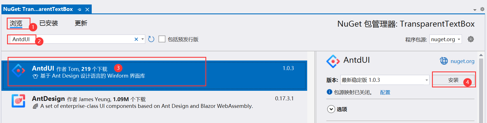
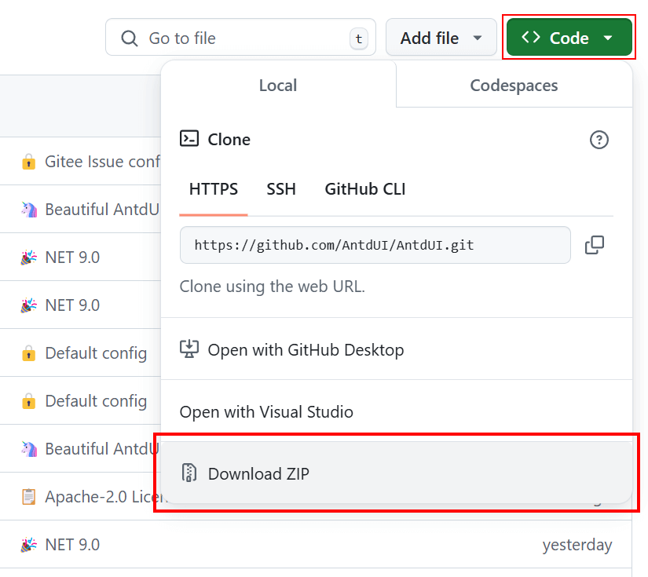

[Home](Home.md)・[UpdateLog](UpdateLog.md)・[Config](Config.md)・[Theme](Theme.md)・[SVG](SVG.md)

## Install

### NuGet Installation

> 👏 Recommending NuGet for swift installation

#### Visual Studio Visual Installation

#### PM command installation
PM> `Install-Package AntdUI`

---

### Source Code Download

> Access the official code repository of AntdUI at ：[https://github.com/AntdUI/AntdUI](https://github.com/AntdUI/AntdUI)

Unzip, launch `AntdUI.sln` and set `examples/Demo` as startup project. `F5` run.

#### Compilation Issues?

> Ensure you have **Visual Studio 2022** or above for compilation.

[Consider installing older versions (like.NET Framework 4.0 and 4.5) of Visual Studio if needed](InstallOldVersionFramework.md)

#### Toolbox Absence?

Modify `AntdUI.csproj` `TargetFrameworks` to retain only your project's framework version and regenerate.

> Still Not Displaying? Restart VS to refresh and recompile repeatedly to ensure latest DLLs are used.