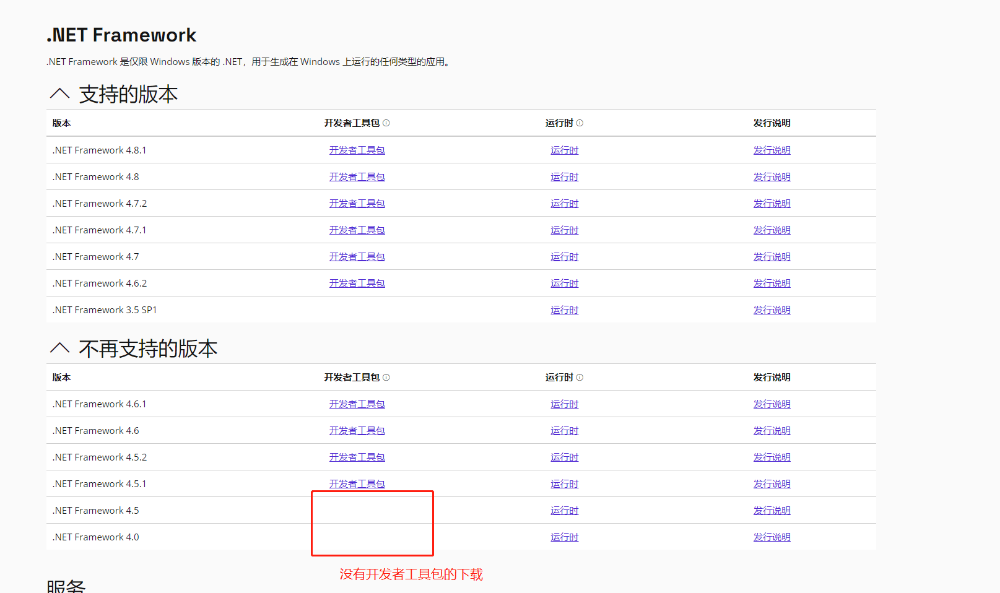
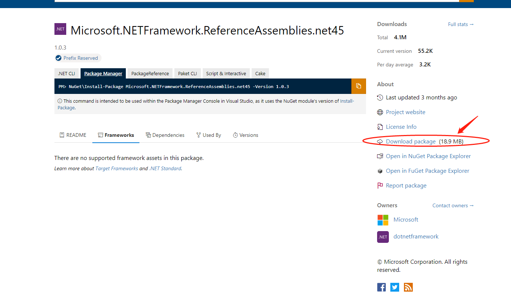
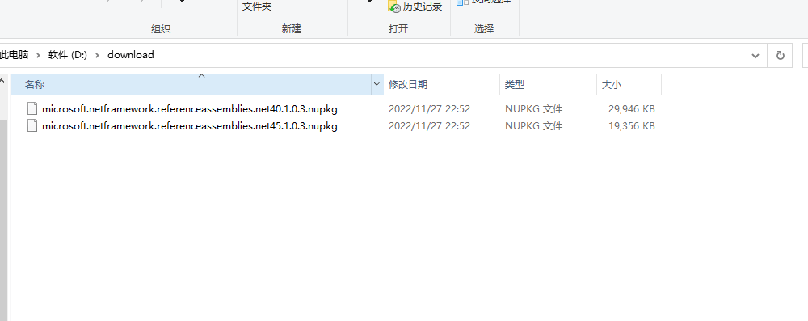
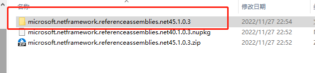
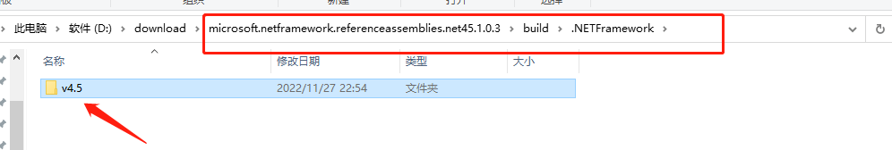
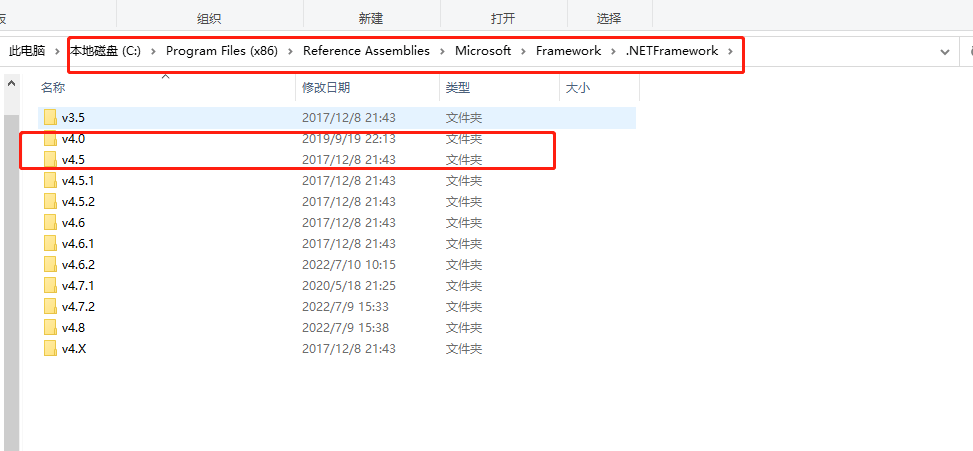

[Home](Home.md)・[UpdateLog](UpdateLog.md)・[Config](Config.md)・[Theme](Theme.md)・[SVG](SVG.md)

### Installing old versions of Visual Studio (.NET Framework 4.0 and 4.5)

***

There is no single component in the Visual Studio 2022 installation program **.NET Framework4.0** or **.NET Framework4.5**

> Other NET versions can be downloaded directly for Visual Studio Developer toolkit in NET SDK

#### Solution:

**Download the 4.0 installation package through Nuget**
Download link: [https://www.nuget.org/packages/Microsoft.NETFramework.ReferenceAssemblies.net40](https://www.nuget.org/packages/Microsoft.NETFramework.ReferenceAssemblies.net40)

**Download the 4.5 installation package through Nuget**
Download link: [https://www.nuget.org/packages/microsoft.netframework.referenceassemblies.net45](https://www.nuget.org/packages/microsoft.netframework.referenceassemblies.net45)

Download the installation package `.nupkg`

Then change the suffix name to `.zip` and extract the contents inside

After decompression, enter `build/.NETFramework`, find v4.5 folder

Copy the `v4.5` folder to **`C:\Program Files (x86)\Reference Assemblies\Microsoft\Framework\.NETFramework`** directly overrides replacement folders and files

Then restart Visual Studio and you will be able to see 4.0 and 4.5