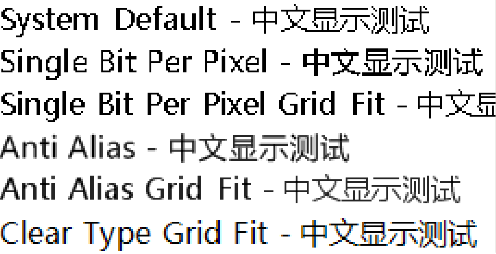

[首页](Home.md)・[更新日志](UpdateLog.md)・[配置](Config.md)・[主题](Theme.md)

### Windows 的字体渲染类型有五种：

* SingleBitPerPixel
* SingleBitPerPixelGridFit
* AntiAlias
* AntiAliasGridFit
* ClearTypeGridFit

它们之间的差别如何呢？

---

#### SingleBitPerPixel

其中的 System Default 在我的系统中其实是 `SingleBitPerPixelGridFit`，可以看到是一样的显示效果，黑色的字体也就用黑色来显示，而不会插值，当然了，`SingleBitPerPixel` 这种方式也是不会插值的，这两者的不同之处在于 `Grid Fit` 是经过网格校正的，所以显示出来的字体更加工整，大家可以看看“宋体”字，在12点大小的显示效果是最棒的。

#### AntiAlias

`AntiAlias` 就是抗锯齿了，实际渲染出来的结果会被插值，黑色的字体可能会被插入灰色的像素。

#### AntiAliasGridFit

`AntiAliasGridFit` 是 `AntiAlias` 的加强版，经过网格校正，显示效果更好。

#### ClearTypeGridFit

`ClearTypeGridFit` 跟上面的插值就不一样了，可以看到黑色的字可能会被插入浅蓝色，土黄色等像素“插值”，因为这样会让字体显示变得模糊，不锐利，但是他更适合高DPI设备下显示，是目前最流行的渲染方式。

### 总结：

`ClearTypeGridFit` 是最流行的，显示器DPI越高，Clear Type 的显示效果越好。

`AntiAlias` 相对来说更平滑

