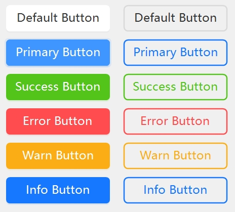
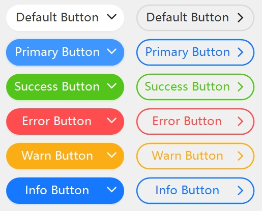

[首页](../Home.md)・[更新日志](../UpdateLog.md)・[配置](../Config.md)・[主题](../Theme.md)

## Button

Button 按钮 👚

> 按钮用于开始一个即时操作。

- 默认属性：Text
- 默认事件：Click

### 属性

名称 | 描述 | 类型 | 默认值 |
:--|:--|:--|:--|
**OriginalBackColor** | 原装背景颜色 | Color | Transparent |
||||
**AutoSize** | 自动大小 | bool | false |
**AutoSizeMode** | 自动大小模式 | [TAutoSize](Enum.md#tautosize) | None |
||||
**ForeColor** | 文字颜色 | Color`?` | `null` |
**BackColor** | 背景颜色 | Color`?` | `null` |
**BackExtend** | 背景渐变色 | string`?` | `null` |
**BackHover** | 悬停背景颜色 | Color`?` | `null` |
**BackActive** | 激活背景颜色 | Color`?` | `null` |
||||
**DefaultBack** | Default模式背景颜色 | Color`?` | `null` |
**DefaultBorderColor** | Default模式边框颜色 | Color`?` | `null` |
||||
**BackgroundImage** | 背景图片 | Image`?` | `null` |
**BackgroundImageLayout** | 背景图片布局 | [TFit](Enum.md#tfit) | Fill |
||||
**BorderWidth** | 边框宽度 | float | 0F |
||||
**WaveSize** | 波浪大小 `点击动画` | int | 4 |
**Radius** | 圆角 | int | 6 |
**Shape** | 形状 | [TShape](Enum.md#tshape) | Default |
**Type** | 类型 | [TTypeMini](Enum.md#ttypemini) | Default |
**Ghost** | 幽灵属性 `使按钮背景透明` | bool | false |
**ShowArrow** | 显示箭头 | bool | false |
**IsLink** | 箭头链接样式 | bool | false |
**RespondRealAreas** | 响应真实区域 | bool | false |
||||
**Text** | 文本 | string`?` | `null` |
🌏 **LocalizationText** | 国际化文本 | string`?` | `null` |
**TextAlign** | 文本位置 | ContentAlignment | MiddleCenter |
**AutoEllipsis** | 文本超出自动处理 | bool | false |
**TextMultiLine** | 是否多行 | bool | false |
**TextCenterHasIcon** 🔴 | 文本居中显示(包含图标后) | bool | false |
||||
**IconRatio** | 图标比例 | float | 0.7F |
**IconGap** | 图标与文字间距比例 | float | 0.25F |
**Icon** | 图标 | Image`?` | `null` |
**IconSvg** | 图标SVG | string`?` | `null` |
**IconHover** | 悬停图标 | Image`?` | `null` |
**IconHoverSvg** | 悬停图标SVG | string`?` | `null` |
**IconHoverAnimation** | 悬停图标动画时长 | int | 200 |
**IconPosition** | 按钮图标组件的位置 | [TAlignMini](Enum.md#talignmini) | Left |
**IconSize** | 图标大小 `不设置为自动大小` | Size | 0 × 0 |
||||
|**切换**||
**Toggle** | 选中状态 | bool | false |
**ToggleIcon** | 切换图标 | Image`?` | `null` |
**ToggleIconSvg** | 切换图标SVG | string`?` | `null` |
**ToggleIconHover** | 切换悬停图标 | Image`?` | `null` |
**ToggleIconHoverSvg** | 切换悬停图标SVG | string`?` | `null` |
**IconToggleAnimation** | 图标切换动画时长 | int | 200 |
**ToggleFore** | 切换文字颜色 | Color`?` | `null` |
**ToggleType** | 切换类型 | [TTypeMini](Enum.md#ttypemini)`?` | `null` |
**ToggleBack** | 切换背景颜色 | Color`?` | `null` |
**ToggleBackExtend** | 切换背景渐变色 | string`?` | `null` |
**ToggleBackHover** | 切换悬停背景颜色 | Color`?` | `null` |
**ToggleBackActive** | 切换激活背景颜色 | Color`?` | `null` |
||||
|**加载**||
**Loading** | 加载状态 `true屏蔽点击` | bool | false |
**LoadingValue** | 加载进度 `0F-1F` | float | 0.3F |
**LoadingWaveValue** | 水波进度 `0F-1F` | float | 0F |
**LoadingWaveColor** | 水波颜色 | Color`?` | `null` |
**LoadingWaveVertical** | 水波是否垂直 | bool | false |
**LoadingWaveSize** | 水波大小 | int | 2 |
**LoadingWaveCount** | 水波数量 | int | 1 |
||||
**JoinLeft** | 连接左边 `组合按钮` | bool | false |
**JoinRight** | 连接右边 `组合按钮` | bool | false |

- 按钮类型 `Type` 右`Ghost=true` `BorderWidth=2F`

- 圆角按钮 `Shape=TShape.Round` 右`ShowArrow=true` `IsLink=true`
