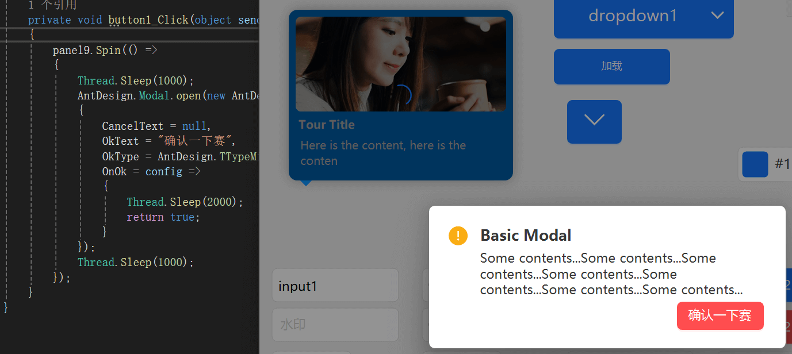

[首页](../Home.md)・[更新日志](../UpdateLog.md)・[配置](../Config.md)・[主题](../Theme.md)

## Spin

Spin 加载中 👚

> 用于页面和区块的加载中状态。

- 默认属性：Text
- 默认事件：Click

### 属性

名称 | 描述 | 类型 | 默认值 |
:--|:--|:--|:--|
**Text** | 文本 | string`?` | `null` |
🌏 **LocalizationText** | 国际化文本 | string`?` | `null` |
**Fill** | 颜色 | Color`?` | `null` |
**ForeColor** | 文字颜色 | Color`?` | `null` |
**Indicator** | 加载指示符 | Image`?` | `null` |
**IndicatorSvg** | 加载指示符SVG | string`?` | `null` |

### 方法

> 所有 继承 `IControl` 的控件都支持 `Spin` 方法

名称 | 描述 | 返回值 | 参数 |
:--|:--|:--|:--|
**Spin** | 加载中 | void | Action action `需要等待的委托`, Action? end = null `运行结束后的回调` |
**Spin** | 加载中 | void | [Spin.Config](#spin.config) `配置`, Action action `需要等待的委托`, Action? end = null `运行结束后的回调` |

### 静态方法

名称 | 描述 | 返回值 | 参数 |
:--|:--|:--|:--|
**open** | 加载中 | Task | Control control `控件主体`, Action<Config> action `需要等待的委托`, Action? end = null `运行结束后的回调`, Action<Exception>? error = null `发生错误时的回调` |
**open** | 加载中 | Task | Control control `控件主体`, string text `加载文本`, Action<Config> action `需要等待的委托`, Action? end = null `运行结束后的回调`, Action<Exception>? error = null `发生错误时的回调` |
**open** | 加载中 | Task | Control control `控件主体`, Action<Config> action `需要等待的委托`, CancellationTokenSource? token `取消令牌`, Action? end = null `运行结束后的回调`, Action<Exception>? error = null `发生错误时的回调` |
**open** | 加载中 | Task | Control control `控件主体`, string text `加载文本`, Action<Config> action `需要等待的委托`, CancellationTokenSource? token `取消令牌`, Action? end = null `运行结束后的回调`, Action<Exception>? error = null `发生错误时的回调` |
**open** | 加载中 | Task | Control control `控件主体`, Config config `自定义配置`, Action<Config> action `需要等待的委托`, Action? end = null `运行结束后的回调`, Action<Exception>? error = null `发生错误时的回调` |
**open** | 加载中 | Task | Control control `控件主体`, Func<Config, Task> action `需要等待的异步委托`, Action? end = null `运行结束后的回调`, Action<Exception>? error = null `发生错误时的回调` |
**open** | 加载中 | Task | Control control `控件主体`, string text `加载文本`, Func<Config, Task> action `需要等待的异步委托`, Action? end = null `运行结束后的回调`, Action<Exception>? error = null `发生错误时的回调` |
**open** | 加载中 | Task | Control control `控件主体`, Func<Config, Task> action `需要等待的异步委托`, CancellationTokenSource? token `取消令牌`, Action? end = null `运行结束后的回调`, Action<Exception>? error = null `发生错误时的回调` |
**open** | 加载中 | Task | Control control `控件主体`, string text `加载文本`, Func<Config, Task> action `需要等待的异步委托`, CancellationTokenSource? token `取消令牌`, Action? end = null `运行结束后的回调`, Action<Exception>? error = null `发生错误时的回调` |
**open** | 加载中 | Task | Control control `控件主体`, Config config `自定义配置`, Func<Config, Task> action `需要等待的异步委托`, Action? end = null `运行结束后的回调`, Action<Exception>? error = null `发生错误时的回调` |

### 配置

#### Spin.Config

名称 | 描述 | 类型 | 默认值 |
:--|:--|:--|:--|
**Text** | 文本 | string`?` | `null` |
**Back** | 背景颜色 | Color`?` | `null` |
**Color** | 颜色 | Color`?` | `null` |
**Fore** | 文本颜色 | Color`?` | `null` |
**Radius** | 圆角 | int`?` | `null` |
**Font** | 字体 | Font`?` | `null` |
**Value** | 进度 | float`?` | `null` |
**Rate** | 进度速率 | float`?` | `null` |
**Indicator** | 加载指示符 | Image`?` | `null` |
**IndicatorSvg** | 加载指示符SVG | string`?` | `null` |
**CancelText** | 取消按钮文字 | string`?` | `取消` |
**CancelTokenSource** | 取消令牌源 | CancellationTokenSource`?` | `null` |

***

### 代码示例

```csharp
需要显示加载中的控件.Spin(config => {
	// 耗时代码
	sleep(1000);
},()=>{
	//加载完成
});
```

```csharp
AntdUI.Spin.open(需要显示加载中的控件, config => {
	// 耗时代码
	sleep(1000);
},()=>{
	//加载完成
});
```

