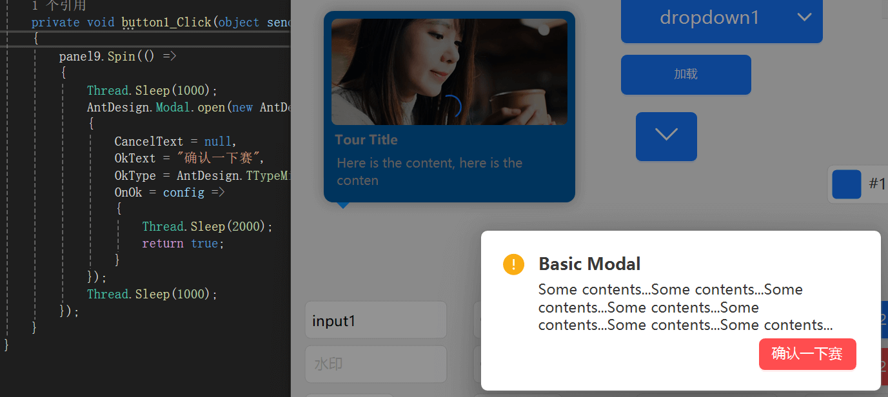

[首页](../Home.md)・[更新日志](../UpdateLog.md)・[配置](../Config.md)・[主题](../Theme.md)

## Spin

Spin 加载中 👚

> 用于页面和区块的加载中状态。

- 默认属性：Text
- 默认事件：Click

### 属性

名称 | 描述 | 类型 | 默认值 |
:--|:--|:--|:--|
**Text** | 文本 | string`?` | `null` |
🌏 **LocalizationText** | 国际化文本 | string`?` | `null` |
**Fill** | 颜色 | Color`?` | `null` |
**ForeColor** | 文字颜色 | Color`?` | `null` |

### 方法

> 所有 继承 `IControl` 的控件都支持 `Spin` 方法

名称 | 描述 | 返回值 | 参数 |
:--|:--|:--|:--|
**Spin** | 加载中 | void | Action action `需要等待的委托`, Action? end = null `运行结束后的回调` |
**Spin** | 加载中 | void | [Spin.Config](#spin.config) `配置`, Action action `需要等待的委托`, Action? end = null `运行结束后的回调` |

### 配置

#### Spin.Config

名称 | 描述 | 类型 | 默认值 |
:--|:--|:--|:--|
**Text** | 文本 | string`?` | `null` |
**Back** | 背景颜色 | Color`?` | `null` |
**Color** | 颜色 | Color`?` | `null` |
**Fore** | 文本颜色 | Color`?` | `null` |
**Radius** | 圆角 | int`?` | `null` |
**Font** | 字体 | Font`?` | `null` |
**Value** | 进度 | float`?` | `null` |

***

### 代码示例

```csharp
需要显示加载中的控件.Spin(config => {
    // 耗时代码
    sleep(1000);
},()=>{
    //加载完成
});
```

```csharp
AntdUI.Spin.open(需要显示加载中的控件, config => {
    // 耗时代码
    sleep(1000);
},()=>{
    //加载完成
});
```

