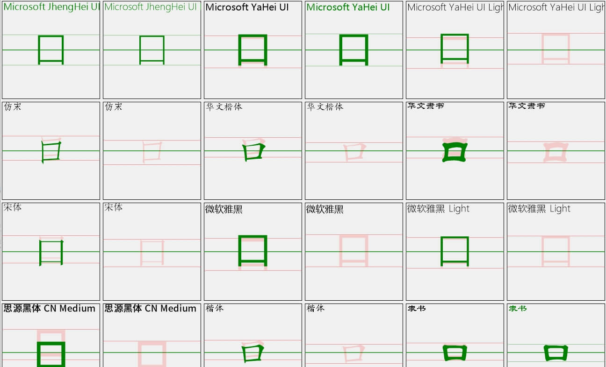

[首页](Home.md)・[更新日志](UpdateLog.md)・[配置](Config.md)・[主题](Theme.md)・[SVG](SVG.md)

## DPI

> 按照文档3部即可完成DPI适配，前提是窗口继承 [BaseForm](Form/BaseForm.md)，
> [Window](Form/Window.md) / [BorderlessForm](Form/BorderlessForm.md) 皆继承于 [BaseForm](Form/BaseForm.md) ，`AutoHandDpi = true` 便会启用缩放使能

### 1、修改VS缩放

> **应使用100%缩放来设计界面**，否则在其他分辨率倍数上会显示不全

#### .NET Core 系列 👏

[解决 Visual Studio 中 Windows 窗体设计器的 HDPI/缩放问题](https://learn.microsoft.com/zh-cn/visualstudio/designers/disable-dpi-awareness?view=vs-2022)

> 在 Visual Studio 2022 版本 17.8 或更高版本中将项目文件 `.csproj` 中的属性 `ForceDesignerDPIUnaware` 设置为 `true`
>
>```xml
><PropertyGroup>
>   ...
>   <ForceDesignerDPIUnaware>true</ForceDesignerDPIUnaware>
></PropertyGroup>

#### 使用CMD启动VS

> 可创建固定快捷方式

```shell
devenv.exe /noScale
```

#### 修改系统缩放

Windows 桌面右键显示设置 将缩放修改至 `100%`


### 2、启用DPI感知

#### .NET Core 系列 👏

> [Application.SetHighDpiMode(HighDpiMode.SystemAware)](https://learn.microsoft.com/zh-cn/dotnet/api/system.windows.forms.application.sethighdpimode?view=windowsdesktop-8.0)
> ``` csharp
> internal static class Program
> {
>     /// <summary>
>     ///  The main entry point for the application.
>     /// </summary>
>     [STAThread]
>     static void Main()
>     {
>         ...
>         Application.SetHighDpiMode(HighDpiMode.SystemAware);
>         Application.Run(new Form1());
>     }
> }
> ```

#### .NET Framework

> 通过清单启用 [Windows 窗体中的高 DPI 支持](https://learn.microsoft.com/zh-cn/dotnet/desktop/winforms/high-dpi-support-in-windows-forms?view=netframeworkdesktop-4.8)

### 3、HDPI 下为何设计器与编译后的布局不一致

> 将每个`.Designer.cs` 中的 `AutoScaleMode` 移除/恢复默认值，移除 `AutoScaleFactor` 也不受影响

---

### 4、其他问题

#### 适配DPI后字体依旧模糊

> [解决字体模糊问题](BlurredFont.md)

#### 字体存在锯齿 （beta🔴）

> [AntdUI.Config.TextRenderingHighQuality](Config.md#文本高质量呈现)
> ``` csharp
> internal static class Program
> {
>     /// <summary>
>     ///  The main entry point for the application.
>     /// </summary>
>     [STAThread]
>     static void Main()
>     {
>         ...
>         AntdUI.Config.TextRenderingHighQuality = true;
>         Application.Run(new Form1());
>     }
> }
> ```

#### 字体没有垂直居中 （beta🔴）

> ``` csharp
> AntdUI.Config.SetCorrectionTextRendering("Microsoft YaHei UI", "宋体"); //需要修正的字体列表
> ```
> 