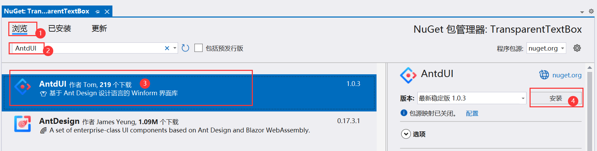
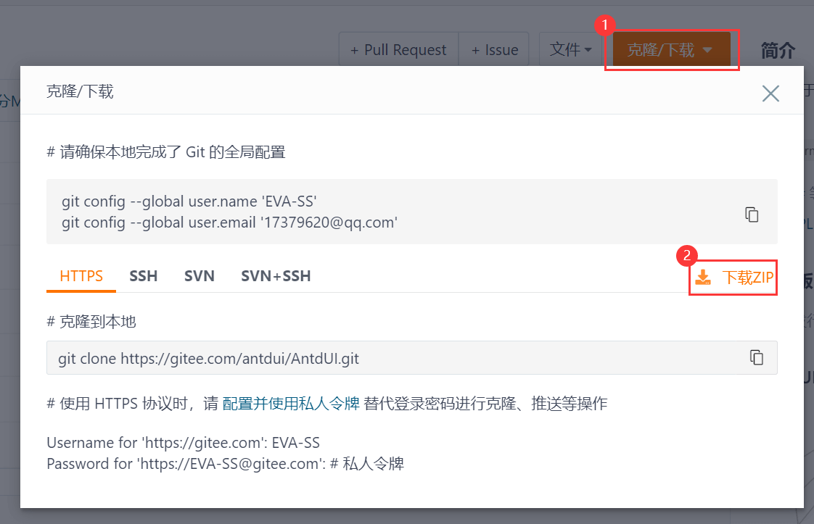
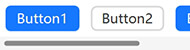
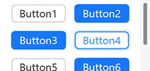
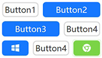
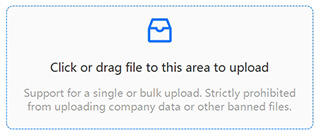

📖 **AntdUI** Ant Design UI

中文・[English](../en/Home.md)・[更新日志](UpdateLog.md)・[配置](Config.md)・[主题](Theme.md)・[SVG](SVG.md)

基于 [dotnet Winforms](https://github.com/dotnet/winforms) 开发的界面库

<strong>安装</strong>

### NuGet安装

> 👏 推荐使用NuGet快速安装

#### 通过Visual Studio可视化安装

#### 通过PM命令安装
PM> `Install-Package AntdUI`

---

### 下载源码

> 打开AntdUI的码云地址：[https://gitee.com/antdui/AntdUI](https://gitee.com/antdui/AntdUI)

解压后双击打开 `AntdUI.sln` 解决方案，将 `examples/Overview` 项目设为启动项目，`F5` 启动

#### 源码下载无法编译？

> 编译器要求 **Visual Studio 2022** 以及以上

[Visual Studio 安装 旧版本(.NET Framework 4.0 和 4.5)](InstallOldVersionFramework.md)

#### 看不到工具箱？

需将 `AntdUI.csproj` 内 `TargetFrameworks` 只保留自己项目使用的框架版本，然后重新生成

> 操作完还是无法显示，重启VS让其重新加载，**多重新生成确保dll是最新的**

---

注意事项

#### 源码下载无法编译❓

编译器要求 **Visual Studio 2022** 以及以上，[Visual Studio 安装 旧版本(.NET Framework 4.0 和 4.5)](InstallOldVersionFramework.md)

####

#### 为什么设计器里面的窗口显示不全❓

HDPI问题，**应使用100%缩放来设计界面**
- 使用CMD `devenv.exe /noScale`
- 👏 [解决 Visual Studio 中 Windows 窗体设计器的 HDPI/缩放问题](https://learn.microsoft.com/zh-cn/visualstudio/designers/disable-dpi-awareness?view=vs-2022) `<ForceDesignerDpiUnaware>true</ForceDesignerDpiUnaware>`
- 桌面右键显示设置 将缩放修改至 `100%`

####

#### 那我如何启用DPI支持呢❓

CORE 可以轻而易举的解决[Application.SetHighDpiMode(HighDpiMode.SystemAware)](https://learn.microsoft.com/zh-cn/dotnet/api/system.windows.forms.application.sethighdpimode?view=windowsdesktop-8.0)；`Framework` 系，需要通过清单启用 [Windows 窗体中的高 DPI 支持](https://learn.microsoft.com/zh-cn/dotnet/desktop/winforms/high-dpi-support-in-windows-forms?view=netframeworkdesktop-4.8)

####

#### HDPI 下为何设计器与编译后的布局不一致❓

将每个`.Designer.cs` 中的 `AutoScaleMode` 移除/恢复默认值，移除 `AutoScaleFactor` 也不受影响

####

#### 适配DPI后字体依旧模糊❓

[解决字体模糊问题](BlurredFont.md)

####

---

<strong>🧰 控件</strong>

### 通用 `2`

#### [Button 按钮](Control/Button.md)

#### [FloatButton 悬浮按钮](Control/FloatButton.md)

### 布局 `4`

#### [Divider 分割线](Control/Divider.md)

#### [StackPanel 堆栈布局](Control/StackPanel.md)

#### [FlowPanel 流动布局](Control/FlowPanel.md)

#### [GridPanel 格栅布局](Control/GridPanel.md)

### 导航 `6`

#### [Breadcrumb 面包屑](Control/Breadcrumb.md)

#### [Dropdown 下拉菜单](Control/Dropdown.md)

#### [Menu 导航菜单](Control/Menu.md)
#### [PageHeader 页头](Control/PageHeader.md)
#### [Pagination 分页](Control/Pagination.md)
#### [Steps 步骤条](Control/Steps.md)

### 数据录入 `13`

#### [Checkbox 多选框](Control/Checkbox.md)
#### [ColorPicker 颜色选择器](Control/ColorPicker.md)
#### [DatePicker 日期选择框](Control/DatePicker.md)
#### [DatePickerRange 日期范围选择框](Control/DatePicker.md#datepickerrange)
#### [Input 输入框](Control/Input.md)
#### [InputNumber 数字输入框](Control/Input.md#inputnumber)
#### [Radio 单选框](Control/Radio.md)
#### [Rate 评分](Control/Rate.md)
#### [Select 选择器](Control/Select.md)
#### [Slider 滑动输入条](Control/Slider.md)
#### [SliderRange 滑动范围输入条](Control/Slider.md#sliderrange)
#### [Switch 开关](Control/Switch.md)
#### [TimePicker 时间选择框](Control/TimePicker.md)
#### [UploadDragger 拖拽上传](Control/UploadDragger.md)

### 数据展示 `16`

#### [Avatar 头像](Control/Avatar.md)
#### [Badge 徽标数](Control/Badge.md)
#### [Calendar 日历](Control/Calendar.md)
#### [Panel 面板](Control/Panel.md)
#### [Carousel 走马灯](Control/Carousel.md)
#### [Collapse 折叠面板](Control/Collapse.md)
#### [Preview 图片预览](Control/Preview.md)
#### [Popover 气泡卡片](Control/Popover.md)
#### [Segmented 分段控制器](Control/Segmented.md)
#### [Table 表格](Control/Table.md)
#### [Tabs 标签页](Control/Tabs.md)
#### [Tag 标签](Control/Tag.md)
#### [Timeline 时间轴](Control/Timeline.md)
#### [Tooltip 文字提示](Control/Tooltip.md)
#### [Tree 树形控件](Control/Tree.md)
#### [Label 文本](Control/Label.md)

### 反馈 `7`

#### [Alert 警告提示](Control/Alert.md)
#### [Drawer 抽屉](Control/Drawer.md)
#### [Message 全局提示](Control/Message.md)
#### [Modal 对话框](Control/Modal.md)
#### [Notification 通知提醒框](Control/Notification.md)
#### [Progress 进度条](Control/Progress.md)
#### [Spin 加载中](Control/Spin.md)

### 其他 `5`

#### [WindowBar 窗口栏](Control/WindowBar.md)
#### [Battery 电量](Control/Battery.md)
#### [Signal 信号强度](Control/Signal.md)
#### [ContextMenuStrip 右键菜单](Control/ContextMenuStrip.md)
#### [Image3D 图片3D](Control/Image3D.md)

---

<strong>🪟 窗口</strong>

#### [Window](Form/Window.md)
#### [BorderlessForm](Form/BorderlessForm.md)
#### [BaseForm](Form/BaseForm.md)

