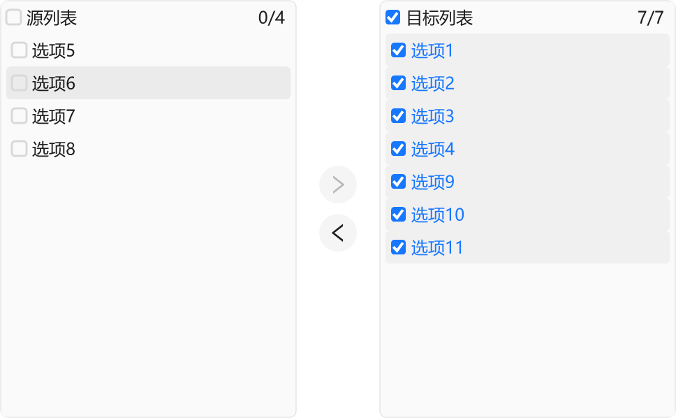
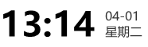

# 📚 AntdUI 文档

> 基于 [dotnet Winforms](https://github.com/dotnet/winforms) 开发的界面库

中文・[English](../en/Home.md)・[更新日志](UpdateLog.md)

## 🎯 指南

- [**安装** - 界面库入门](Install.md)
- [**DPI** - 高分辨率模糊/字体看起来不清晰](DPI.md)
- [**配置** - 全局配置](Config.md)
- [**主题** - 浅色深色模式 自定义主题](Theme.md)
- [**SVG** - 引用/来源](SVG.md)
- [**AOT** - 本机代码](AOT.md)

## 🧰 控件

### 通用 `2`

#### [Button 按钮](Control/Button.md)

> 按钮用于开始一个即时操作。

> 

#### [FloatButton 悬浮按钮](Control/FloatButton.md)

> 悬浮按钮。

> 

### 布局 `5`

#### [Divider 分割线](Control/Divider.md)

> 区隔内容的分割线。

> 

#### [StackPanel 堆栈布局](Control/StackPanel.md)

> 按水平或垂直方向排列子元素。

> 

#### [FlowPanel 流动布局](Control/FlowPanel.md)

> 按行排列子元素，自动换行。

> 

#### [GridPanel 格栅布局](Control/GridPanel.md)

> 将内容划分为行和列的网格。

> 

#### [Splitter 分隔面板](Control/Splitter.md)

> 自由切分指定区域。

> 

### 导航 `7`

#### [Breadcrumb 面包屑](Control/Breadcrumb.md)

> 显示当前页面在系统层级结构中的位置，并能向上返回。

> 

#### [Dropdown 下拉菜单](Control/Dropdown.md)

> 向下弹出的列表。

> 

#### [Menu 导航菜单](Control/Menu.md)

> 为页面和功能提供导航的菜单列表。

> 

#### [PageHeader 页头](Control/PageHeader.md)

> 页面头部和三大金刚键，起到了内容概览和引导页级操作的作用。

> 

#### [TabHeader 多标签页头](Control/TabHeader.md)

> 多标签页切换页头。

> 

#### [Pagination 分页](Control/Pagination.md)

> 采用分页的形式分隔长列表，每次只加载一个页面。

> 

#### [Steps 步骤条](Control/Steps.md)

> 引导用户按照流程完成任务的导航条。

> 

### 导数据录入 `15`

#### [Checkbox 多选框](Control/Checkbox.md)

> 多选框。

> 

#### [ColorPicker 颜色选择器](Control/ColorPicker.md)

> 提供颜色选取的组件。

> 

#### [DatePicker 日期选择框](Control/DatePicker.md)

> 输入或选择日期的控件。

> 

#### [DatePickerRange 日期范围选择框](Control/DatePicker.md#datepickerrange)

> 输入或选择日期范围的控件。

> 

#### [Input 输入框](Control/Input.md)

> 通过鼠标或键盘输入内容，是最基础的表单域的包装

> 

#### [InputNumber 数字输入框](Control/Input.md#inputnumber)

> 通过鼠标或键盘，输入范围内的数值

> 

#### [Radio 单选框](Control/Radio.md)

> 单选框

> 

#### [Rate 评分](Control/Rate.md)

> 评分组件

> 

#### [Select 选择器](Control/Select.md)

> 下拉选择器

> 

#### [Slider 滑动输入条](Control/Slider.md)

> 滑动型输入器，展示当前值和可选范围

> 

#### [SliderRange 滑动范围输入条](Control/Slider.md#sliderrange)

> 滑动型范围输入器

> 

#### [Switch 开关](Control/Switch.md)

> 开关选择器

> 

#### [TimePicker 时间选择框](Control/TimePicker.md)

> 输入或选择时间的控件

> 

#### [Transfer 穿梭框](Control/Transfer.md)

> 双栏穿梭选择框，用于在两个区域之间移动元素

> 

#### [UploadDragger 拖拽上传](Control/UploadDragger.md)

> 文件选择上传和拖拽上传控件

> 

### 数据展示 `18`

#### [Avatar 头像](Control/Avatar.md)

> 用来代表用户或事物，支持图片、图标或字符展示

> 

#### [Badge 徽标数](Control/Badge.md)

> 图标右上角的圆形徽标数字

> 

#### [Calendar 日历](Control/Calendar.md)

> 按照日历形式展示数据的容器

> 

#### [Panel 面板](Control/Panel.md)

> 内容区域

> 

#### [Carousel 走马灯](Control/Carousel.md)

> 旋转木马，一组轮播的区域

> 

#### [Collapse 折叠面板](Control/Collapse.md)

> 可以折叠/展开的内容区域

> 

#### [Preview 图片预览](Control/Preview.md)

> 图片预览框

> 

#### [Popover 气泡卡片](Control/Popover.md)

> 弹出气泡式的卡片浮层。

> 

#### [Segmented 分段控制器](Control/Segmented.md)

> 分段控制器。

> 

#### [Table 表格](Control/Table.md)

> 展示行列数据。

> 

#### [Tabs 标签页](Control/Tabs.md)

> 选项卡切换组件。

> 

#### [Tag 标签](Control/Tag.md)

> 进行标记和分类的小标签。

> 

#### [Timeline 时间轴](Control/Timeline.md)

> 垂直展示的时间流信息。

> 

#### [Tooltip 文字提示](Control/Tooltip.md)

> 简单的文字提示气泡框。

> 

#### [Tree 树形控件](Control/Tree.md)

> 多层次的结构列表。

> 

#### [Tour 漫游式引导](Control/Tour.md)

> 用于分步引导用户了解产品功能的气泡组件。

> 

#### [Label 文本](Control/Label.md)

> 显示一段文本。

#### [LabelTime 时间文本](Control/LabelTime.md)

> 显示时间文本。

> 

### 反馈 `7`

#### [Alert 警告提示](Control/Alert.md)

> 警告提示，展现需要关注的信息。

> 

#### [Drawer 抽屉](Control/Drawer.md)

> 屏幕边缘滑出的浮层面板。

> 

#### [Message 全局提示](Control/Message.md)

> 全局展示操作反馈信息。

> 

#### [Modal 对话框](Control/Modal.md)

> 模态对话框。

> 

#### [Notification 通知提醒框](Control/Notification.md)

> 全局展示通知提醒信息。

> 

#### [Progress 进度条](Control/Progress.md)

> 展示操作的当前进度。

> 

#### [Spin 加载中](Control/Spin.md)

> 用于页面和区块的加载中状态。

> 

### 其他 `5`

#### ~~[WindowBar 窗口栏](Control/WindowBar.md)~~

> ⚠ 已移除 使用 [PageHeader 页头](Control/PageHeader.md) 替换

#### [Battery 电量](Control/Battery.md)

> 展示设备电量
> 

#### [Signal 信号强度](Control/Signal.md)

> 展示设备信号
> 

#### [Shield 徽章](Control/Shield.md)

> 展示徽章图标
> 

#### [ContextMenuStrip 右键菜单](Control/ContextMenuStrip.md)

> 展示右键菜单 |
> 

#### [Image3D 图片3D](Control/Image3D.md)

> 展示3D效果图片 |
> 

## 🪟 窗口

### 窗口 `3`

#### [Window](Form/Window.md)

> 原生特性窗口 `隐藏标题栏`

#### [BorderlessForm](Form/BorderlessForm.md)

> 无边框窗口 `GDI 阴影`

#### [BaseForm](Form/BaseForm.md)

> DPI 基础窗口
