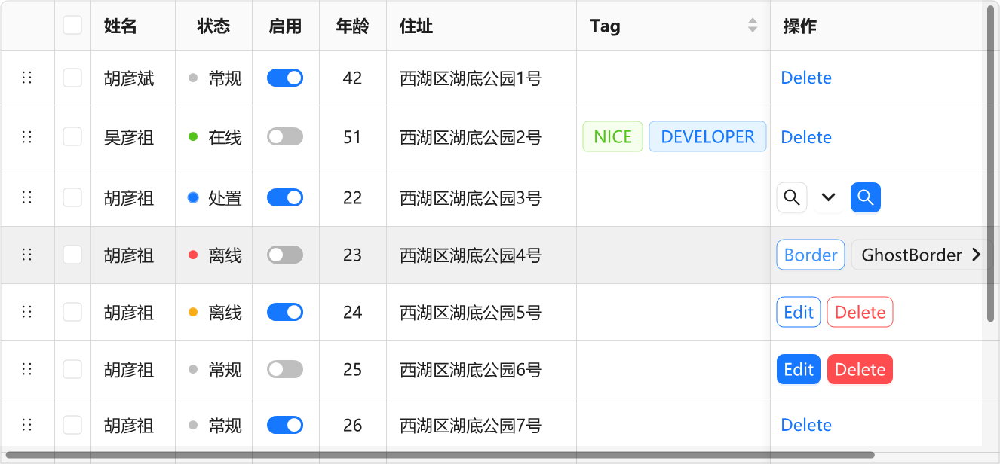

📚 **AntdUI** 文档

> 基于 [dotnet Winforms](https://github.com/dotnet/winforms) 开发的界面库

中文・[English](../en/Home.md)・[更新日志](UpdateLog.md)

- [**安装** 界面库入门](Install.md)
- [**DPI** 高分辨率模糊/字体看起来不清晰](DPI.md)
- [**配置** 全局配置](Config.md)
- [**主题** 浅色深色模式 自定义主题](Theme.md)
- [**SVG** 引用/来源](SVG.md)
- [**AOT** 本机代码](AOT.md)

---

## 🧰 控件

### 通用 `2`

#### [Button 按钮](Control/Button.md)

#### [FloatButton 悬浮按钮](Control/FloatButton.md)

### 布局 `5`

#### [Divider 分割线](Control/Divider.md)

#### [StackPanel 堆栈布局](Control/StackPanel.md)

#### [FlowPanel 流动布局](Control/FlowPanel.md)

#### [GridPanel 格栅布局](Control/GridPanel.md)

#### [Splitter 分隔面板](Control/Splitter.md)

### 导航 `7`

#### [Breadcrumb 面包屑](Control/Breadcrumb.md)

#### [Dropdown 下拉菜单](Control/Dropdown.md)

#### [Menu 导航菜单](Control/Menu.md)

#### [PageHeader 页头](Control/PageHeader.md)

#### [TabHeader 多标签页头](Control/TabHeader.md)

#### [Pagination 分页](Control/Pagination.md)

#### [Steps 步骤条](Control/Steps.md)

### 数据录入 `13`

#### [Checkbox 多选框](Control/Checkbox.md)

#### [ColorPicker 颜色选择器](Control/ColorPicker.md)

#### [DatePicker 日期选择框](Control/DatePicker.md)

#### [DatePickerRange 日期范围选择框](Control/DatePicker.md#datepickerrange)

#### [Input 输入框](Control/Input.md)

#### [InputNumber 数字输入框](Control/Input.md#inputnumber)

#### [Radio 单选框](Control/Radio.md)

#### [Rate 评分](Control/Rate.md)

#### [Select 选择器](Control/Select.md)

#### [Slider 滑动输入条](Control/Slider.md)

#### [SliderRange 滑动范围输入条](Control/Slider.md#sliderrange)

#### [Switch 开关](Control/Switch.md)

#### [TimePicker 时间选择框](Control/TimePicker.md)

#### [UploadDragger 拖拽上传](Control/UploadDragger.md)

### 数据展示 `18`

#### [Avatar 头像](Control/Avatar.md)

#### [Badge 徽标数](Control/Badge.md)

#### [Calendar 日历](Control/Calendar.md)
#### [Panel 面板](Control/Panel.md)

#### [Carousel 走马灯](Control/Carousel.md)

#### [Collapse 折叠面板](Control/Collapse.md)

#### [Preview 图片预览](Control/Preview.md)

#### [Popover 气泡卡片](Control/Popover.md)

#### [Segmented 分段控制器](Control/Segmented.md)

#### [Table 表格](Control/Table.md)

#### [Tabs 标签页](Control/Tabs.md)

#### [Tag 标签](Control/Tag.md)

#### [Timeline 时间轴](Control/Timeline.md)

#### [Tooltip 文字提示](Control/Tooltip.md)

#### [Tree 树形控件](Control/Tree.md)

#### [Tour 漫游式引导](Control/Tour.md)
#### [Label 文本](Control/Label.md)
#### [LabelTime 时间文本](Control/LabelTime.md)

### 反馈 `7`

#### [Alert 警告提示](Control/Alert.md)

#### [Drawer 抽屉](Control/Drawer.md)
#### [Message 全局提示](Control/Message.md)

#### [Modal 对话框](Control/Modal.md)

#### [Notification 通知提醒框](Control/Notification.md)

#### [Progress 进度条](Control/Progress.md)

#### [Spin 加载中](Control/Spin.md)

### 其他 `5`

#### ~~[WindowBar 窗口栏](Control/WindowBar.md)~~

> ⚠ 已移除 使用 [PageHeader 页头](Control/PageHeader.md) 替换

#### [Battery 电量](Control/Battery.md)

#### [Signal 信号强度](Control/Signal.md)

#### [Shield 徽章](Control/Shield.md)

#### [ContextMenuStrip 右键菜单](Control/ContextMenuStrip.md)

#### [Image3D 图片3D](Control/Image3D.md)

---

## 🪟 窗口

#### [Window](Form/Window.md)
#### [BorderlessForm](Form/BorderlessForm.md)
#### [BaseForm](Form/BaseForm.md)