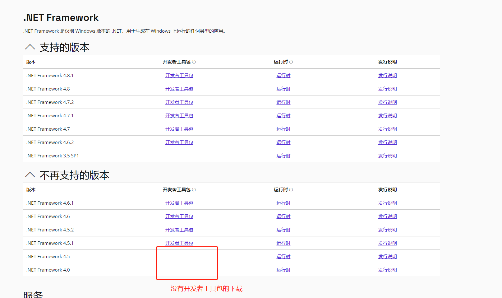
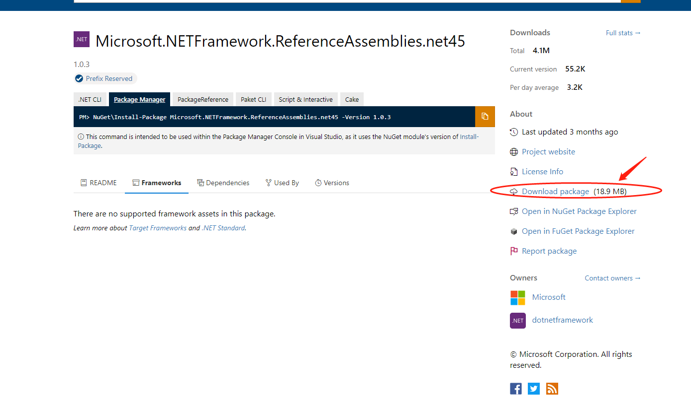
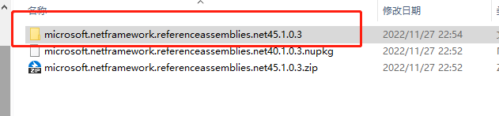
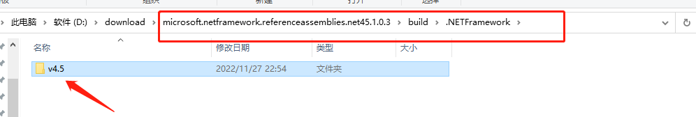
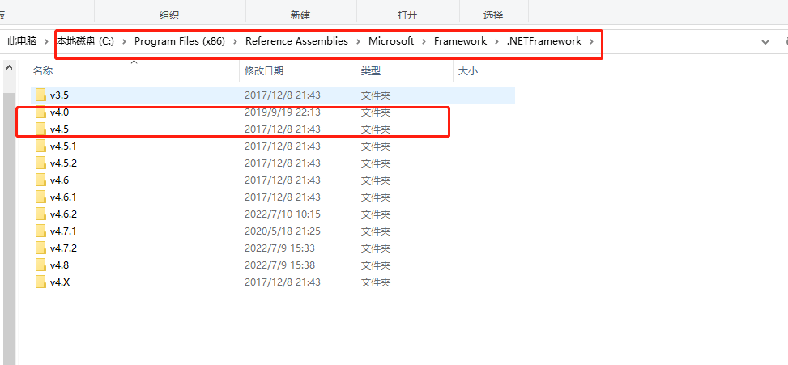

[首页](Home.md)・[更新日志](UpdateLog.md)・[配置](Config.md)・[主题](Theme.md)

### Visual Studio 安装 旧版本(.NET Framework 4.0 和 4.5)

***

Visual Studio 2022 安装程序中单个组件中没有 **.NET Framework4.0** 或者 **.NET Framework4.5**

> 其他NET版本直接在下载适用于 Visual Studio 的 .NET SDK 中的开发者工具包

#### 解决方式：

**通过 nuget 下载 4.0 安装包**
下载地址：[https://www.nuget.org/packages/Microsoft.NETFramework.ReferenceAssemblies.net40](https://www.nuget.org/packages/Microsoft.NETFramework.ReferenceAssemblies.net40)

**通过nuget 下载 4.5 安装包**
下载地址：[https://www.nuget.org/packages/microsoft.netframework.referenceassemblies.net45](https://www.nuget.org/packages/microsoft.netframework.referenceassemblies.net45)

下载得到安装包 `.nupkg`

然后后缀名字修改为`.zip`解压后得到里面的内容

解压后，进入`build/.NETFramework`文件夹，找到v4.5文件夹

将`v4.5`文件夹 复制到 **`C:\Program Files (x86)\Reference Assemblies\Microsoft\Framework\.NETFramework`** 直接覆盖替换文件夹和文件

然后重启 Visual Studio，就能看到4.0和4.5了