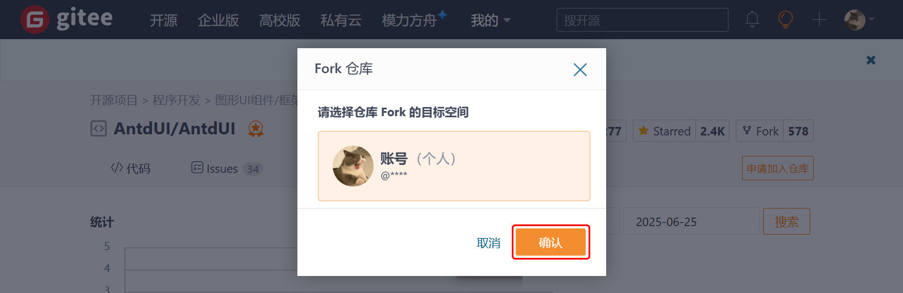
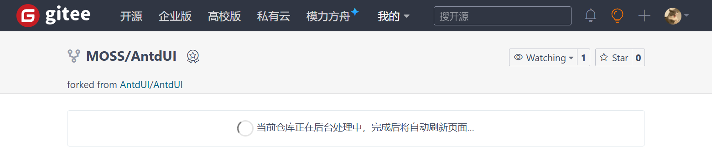
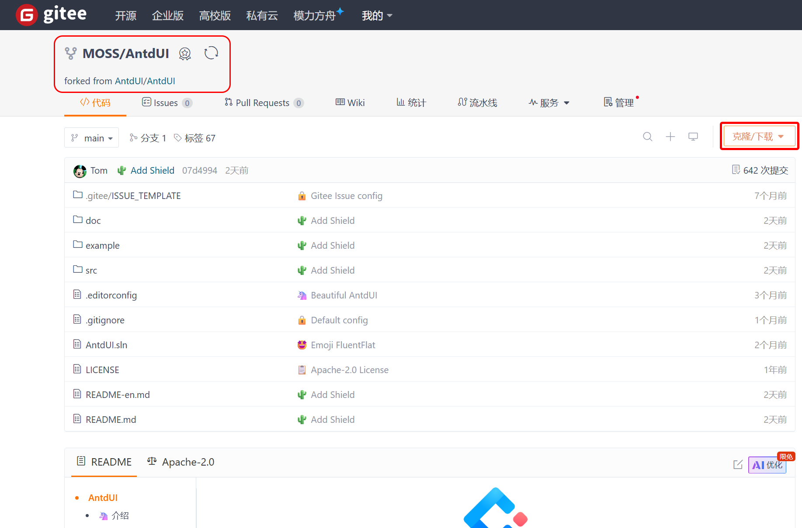
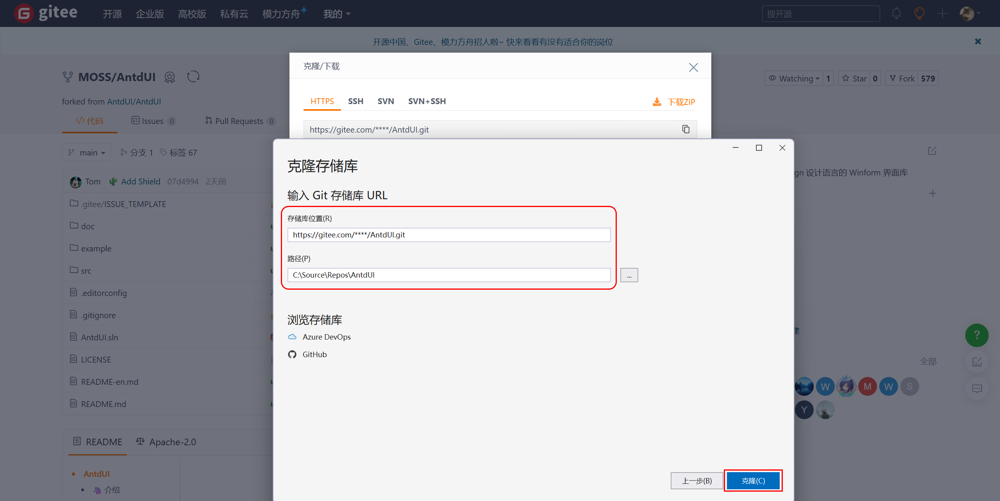
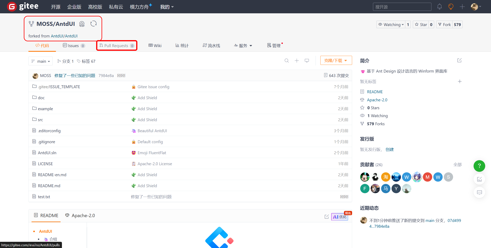
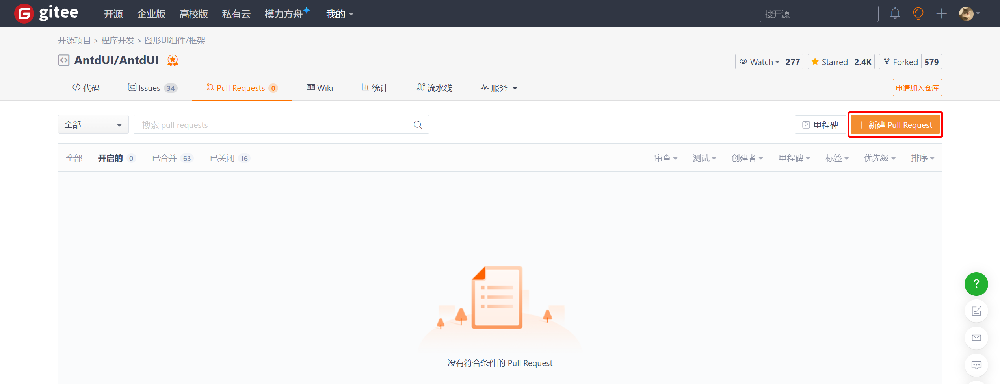

[首页](Home.md)・[更新日志](UpdateLog.md)・[配置](Config.md)・[主题](Theme.md)

## 在 [Gitee](https://gitee.com) 向 [AntdUI](https://gitee.com/AntdUI/AntdUI) 贡献

为演示如何使用 [**Pull Request**](https://gitee.com/AntdUI/AntdUI/compare/main...main)（以下统称“PR”）贡献代码，将使用 **MOSS** 空间地址（每个人的空间地址不同）来演示

***

### 1. 首先在 [AntdUI](https://gitee.com/AntdUI/AntdUI) 官方仓库，Fork 到自己账号

> 点击右上角 **Fork** 按钮

### 2. 选择 Fork 目标空间

> 默认个人，也就是自己，点击 **确认** 继续

> 等待 Fork 完成，完成后会自动跳转
> 

### 3. 在自己空间地址克隆项目

> 点击 **克隆/下载**，⚠ 注意是自己的**空间地址**

点击第一个 `.git` 地址复制

### 4. 提交贡献代码到自己仓库

> 打开 [Visual Studio](https://visualstudio.microsoft.com) 克隆刚刚复制的地址，选择目录，点击 **克隆** 继续

克隆成功后，提交需要贡献的代码

### 5. 发起 [PR](https://gitee.com/AntdUI/AntdUI/compare/main...main)

> 点击 **Pull requests** 选项卡，或者[点击**Pull Request**跳转提交PR页面](https://gitee.com/AntdUI/AntdUI/compare/main...main)

点击 **新建 Pull Request**

### 大功告成

提交内容调整核实后，点击 **创建 Pull Request**

> 收到后，我会尽快审核，🧙 生活愉快