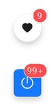
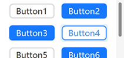
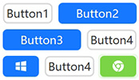
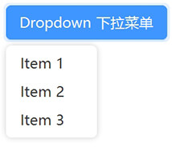



<h1>AntdUI</h1>

中文・[English](README-en.md)・[文档](doc/wiki/zh/首页.md)・[演示](https://gitee.com/mubaiyanghua/antdui-demo)

🦄 **AntdUI** Ant Design UI

基于 [dotnet Winforms](https://github.com/dotnet/winforms) 开发的界面库

<kbd>使用之前的注意事项</kbd>

#### 源码下载无法编译❓

编译器要求 **Visual Studio 2022** 以及以上，[Visual Studio 安装 旧版本(.NET Framework 4.0 和 4.5)](安装旧版本Framework)

####

#### 为什么设计器里面的窗口显示不全❓

HDPI问题，**应使用100%缩放来设计界面**
- 使用CMD `devenv.exe /noScale`
- 👏 [解决 Visual Studio 中 Windows 窗体设计器的 HDPI/缩放问题](https://learn.microsoft.com/zh-cn/visualstudio/designers/disable-dpi-awareness?view=vs-2022) `<ForceDesignerDpiUnaware>true</ForceDesignerDpiUnaware>`
- 桌面右键显示设置 将缩放修改至 `100%`

####

#### 那我如何启用DPI支持呢❓

CORE 可以轻而易举的解决[Application.SetHighDpiMode(HighDpiMode.SystemAware)](https://learn.microsoft.com/zh-cn/dotnet/api/system.windows.forms.application.sethighdpimode?view=windowsdesktop-8.0)；`Framework` 系，需要通过清单启用 [Windows 窗体中的高 DPI 支持](https://learn.microsoft.com/zh-cn/dotnet/desktop/winforms/high-dpi-support-in-windows-forms?view=netframeworkdesktop-4.8)

####

#### HDPI 下为何设计器与编译后的布局不一致❓

将每个`.Designer.cs` 中的 `AutoScaleMode` 移除/恢复默认值，移除 `AutoScaleFactor` 也不受影响

####

#### 适配DPI后字体依旧模糊❓

[解决字体模糊问题](字体模糊)

####

## 🧰 控件

### 通用 `2`

#### [Button 按钮](控件/Button)

#### [FloatButton 悬浮按钮](控件/FloatButton)

### 布局 `4`

#### [Divider 分割线](控件/Divider)

#### [StackPanel 堆栈布局](控件/StackPanel)

#### [FlowPanel 流动布局](控件/FlowPanel)

#### [GridPanel 格栅布局](控件/GridPanel)

### 导航 `6`

#### [Breadcrumb 面包屑](控件/Breadcrumb)

#### [Dropdown 下拉菜单](控件/Dropdown)

#### [Menu 导航菜单](控件/Menu)
#### [PageHeader 页头](控件/PageHeader)
#### [Pagination 分页](控件/Pagination)
#### [Steps 步骤条](控件/Steps)

### 数据录入 `13`

#### [Checkbox 多选框](控件/Checkbox)
#### [ColorPicker 颜色选择器](控件/ColorPicker)
#### [DatePicker 日期选择框](控件/DatePicker)
#### [DatePickerRange 日期范围选择框](控件/DatePicker#datepickerrange)
#### [Input 输入框](控件/Input)
#### [InputNumber 数字输入框](控件/Input#inputnumber)
#### [Radio 单选框](控件/Radio)
#### [Rate 评分](控件/Rate)
#### [Select 选择器](控件/Select)
#### [Slider 滑动输入条](控件/Slider)
#### [SliderRange 滑动范围输入条](控件/Slider#sliderrange)
#### [Switch 开关](控件/Switch)
#### [TimePicker 时间选择框](控件/TimePicker)
#### [UploadDragger 拖拽上传](控件/UploadDragger)

### 数据展示 `16`

#### [Avatar 头像](控件/Avatar)
#### [Badge 徽标数](控件/Badge)
#### [Calendar 日历](控件/Calendar)
#### [Panel 面板](控件/Panel)
#### [Carousel 走马灯](控件/Carousel)
#### [Collapse 折叠面板](控件/Collapse)
#### [Preview 图片预览](控件/Preview)
#### [Popover 气泡卡片](控件/Popover)
#### [Segmented 分段控制器](控件/Segmented)
#### [Table 表格](控件/Table)
#### [Tabs 标签页](控件/Tabs)
#### [Tag 标签](控件/Tag)
#### [Timeline 时间轴](控件/Timeline)
#### [Tooltip 文字提示](控件/Tooltip)
#### [Tree 树形控件](控件/Tree)
#### [Label 文本](控件/Label)

### 反馈 `7`

#### [Alert 警告提示](控件/Alert)
#### [Drawer 抽屉](控件/Drawer)
#### [Message 全局提示](控件/Message)
#### [Modal 对话框](控件/Modal)
#### [Notification 通知提醒框](控件/Notification)
#### [Progress 进度条](控件/Progress)
#### [Spin 加载中](控件/Spin)

### 聊天 `2`

#### [MsgList 好友消息列表](聊天/MsgList)
#### [ChatList 气泡聊天列表](聊天/ChatList)

### 其他 `5`

#### [WindowBar 窗口栏](控件/WindowBar)
#### [Battery 电量](控件/Battery)
#### [Signal 信号强度](控件/Signal)
#### [ContextMenuStrip 右键菜单](控件/ContextMenuStrip)
#### [Image3D 图片3D](控件/Image3D)

## 🪟 窗口

#### [Window](窗口/Window)
#### [BorderlessForm](窗口/BorderlessForm)
#### [BaseForm](窗口/BaseForm)